### Digital Diary from Antarctica 2021-2022

This is a collection of the email updates I sent back to family along my trip. The formatting from email to my website wasn’t perfect, but I've tried to keep it neat. Each update is labeled by the date I sent it. 

## September 27 2021

Hello Everyone!

(I took this email list from the last family email I could find, please fwd to anyone I forgot!)

I'm excited to say that everything seems to have fallen into place and I'll be headed to Antarctica this winter! I wanted to let you all know my timeline in case you are curious and mention how to get in contact with me if you'd like.

Quarantine in SF Oct 5-10 with internet/cell coverage.  
Quarantine in NZ Oct 10-Oct 25(ish) with internet/cell coverage (but long distance fees)  
McMurdo base Oct 26(ish)-Nov 20(ish)  with extremely limited internet, no cell coverage.  
Deep Field Nov 21(ish) - Jan 26th(ish) with no internet, no cell coverage.  
McMurdo base Jan 27th - Feb 1(ish) with extremely limited internet, no cell coverage.  
NZ-SFO homeward bound Feb 1(ish) - Feb 14(ish) with internet/cell coverage.  

I'll try to send some email updates if you're curious to follow me around. I'll try not to be too spammy I promise. In SF/NZ I will have normal internet access and can ZOOM/Skype/email/etc. In McMurdo I will only be able to do text only emails, and my access to the internet is limited to certain hours of the day. 

When I'm out of internet coverage, I will update my InReach device periodically, which you can see here:

[broken link]  
[pw]

If you go there now you'll see updates from my other trips, but you'll start to see updates from Antarctica soon enough. You should be able to send me text only messages here as well if you'd like, but please don't do so until late november as I won't be checking my InReach until then. If you send me a message remember to sign-off with your name, my InReach doesn't have contact cards and I don't want to mix you up! Also in Antarctica we run on NZ time, so my messages may come at odd times. 

  

    

    

  

Meanwhile, I'm just starting my pre-quarantine distancing today and desperately trying to pack all the warm stuff I own! 

I'll miss you all this winter, and I'll definitely be thinking of you all as I celebrate Thanksgiving/Christmas/New Years in a tent on the bottom of the world!

A fun update, you can send me mail! You can address letters/postcards (probably not packages) to:

[Participant's Name]  
Grantee, C-446  
PSC 769 Box 700  
APO AP 96599-9998  
Regular postage is fine. It goes through military mail.  

I think it'll probably take about a month to get down there, and from a friend's experience it seems like a fair amount of letters go missing, so maybe take a photo before sending it if you want to be sure I see what you wrote!

## October 24 2021

After almost 20 days of quarantine and travel, it finally feels like we're almost there! Today we checked out of NZ mandatory quarantine, and are now in USAP (United States Antarctic Program) managed isolation until we fly out to Antarctica tomorrow morning (hopefully!). Our last to-do was to get our Extreme Cold Weather (ECW) clothing from USAP headquarters in Christchurch. That featured trying on many sizes of all items of clothing, including the famous "Big Red" which you can see consuming me alive below. (that's a size medium). I was sure to grab plenty of gloves and mittens as well! We will have to wear all this clothing on the flight tomorrow, so it will probably be a warm flight. This means we must board the plane WEARING insulated pants, "Big Red" parka, winter boots, gloves, warm hat, and ski goggles! I'm told people usually take some items off once they find their seats thankfully. They require this to ensure that everyone doesn't forget any pieces of clothing, and to make sure we are all prepared in case of a less than ideal landing or bad weather when we off-board from the plane. 

I'm excited to finally be traveling anywhere outside my hotel room after the last 20 days, and especially excited to finally almost be in McMurdo! We've additionally started to go over our field detailed plan with our mountaineers for how we will manage our science and safety objectives for the actual field season. Finalizing this plan and getting all the appropriate approvals is our first task to do in McMurdo once we land, so I'm glad we're starting this early. 

Hopefully I'll be able to send email and photo updates pretty soon after I land in Mcmurdo! I'll certainly send an InReach message when we arrive. I will also start checking my InReach more often now, so you can feel free to either message me there or via email for the next month or so.

Missing you all, and sending my love from (almost) the bottom of the world!
-Paul

  

    
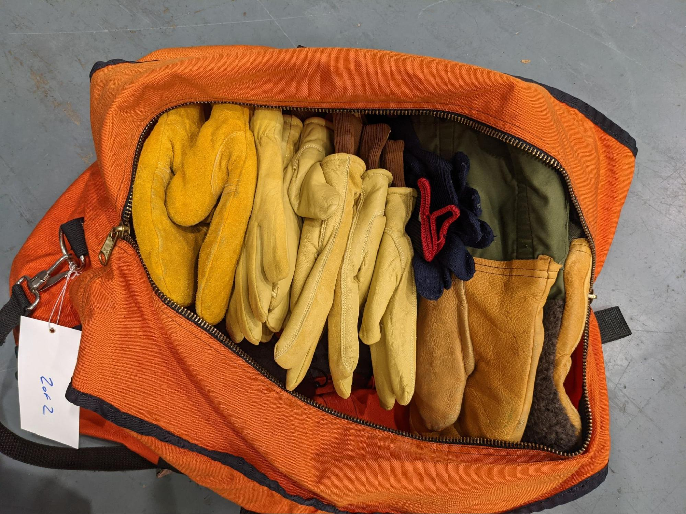

    
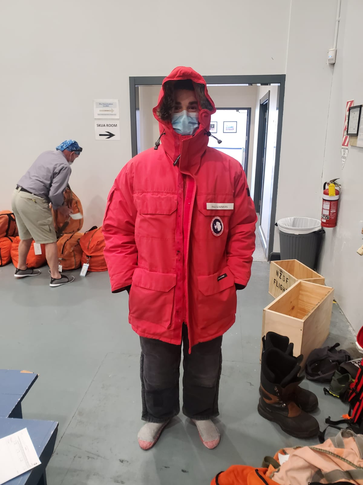

    
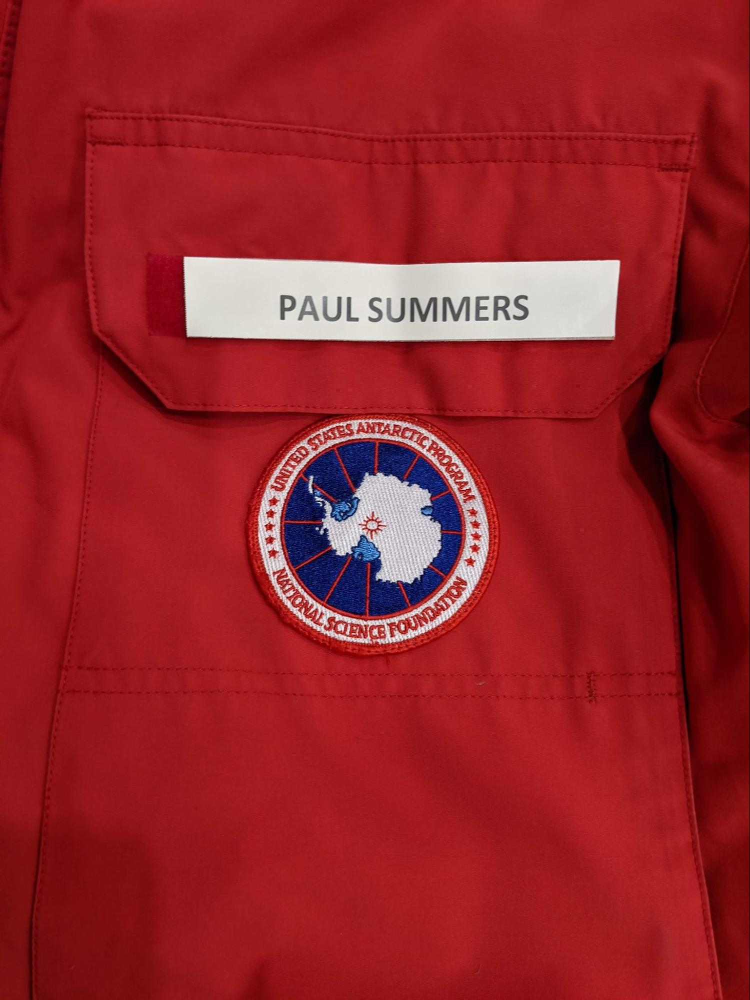

    
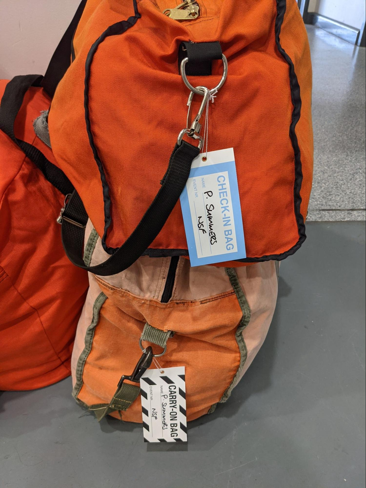

  

## October 29 2021

In an exciting and slow-to-update update, I've made it! We flew down on our first attempt with no weather or mechanical delays which is evidently quite rare, hopefully this luck will hold for the whole season. We flew on a NZFD 757 which was fairly similar to a commercial flight, including a drink cart with hot tea and coffee! The flight was a pretty fast 5 hours and featured some beautiful views of the sea ice, some of the more northern mountains and glaciers. Unfortunately I have to downsize all these photos but I hope they attempt to do it justice! 

Once we landed on the ice (the plane literally lands on the sea ice), after a brief selfie, we headed over the IVAN terra bus that drove us the 45 minute or so drive to McMurdo base. The speed limit is 25 mph on the fastest of roads here, so the going is always a little slow, but it beats walking in the cold.

In addition to the pretty typical orientation trainings (here's the dining hall, showers, don't tease the penguins etc) our primary task now is sorting out all of the equipment for our field camp. This means finding where it has been stored, checking it all for fit and condition (check every zipper!) and then chasing down replacements for all the missing/broken equipment. Given we're out for 2 months in cold conditions it turns out this list is quite long! Some favorite items are 400+ hand warmers, a very cozy sleeping bag (pictured). An unfortunate touch is just how similar our issued pee bottles and water bottles look, hopefully I won't mix them up! The yellow tape is an addition of my own. The bottles are nice to have when its -40F outside your tent in the middle of the night, and necessary around McMurdo where peeing is strictly forbidden on any hiking trails due to the sensitivity of the habitat around the base.

All in all McMurdo is a very active and fun place! I feel it's a bit of a cross between freshman year of college and summer camp. We live in dorms, eat at a communal dining hall, there are activity rooms like a craft room, there's a number of bars with pool and darts tournaments, and I always seem to have 3 more homework assignments due before the weekend! 

With that I should be off to bed here, Saturday is a workday here so I have to be off to bed for another early morning training!
Love you!
-Paul

  

    
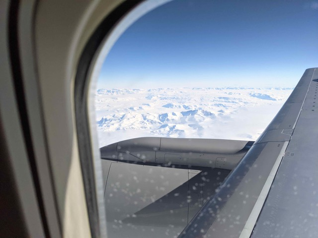

    
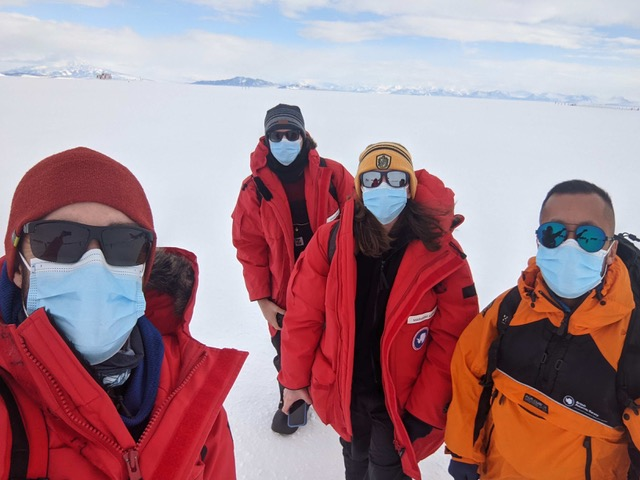

    
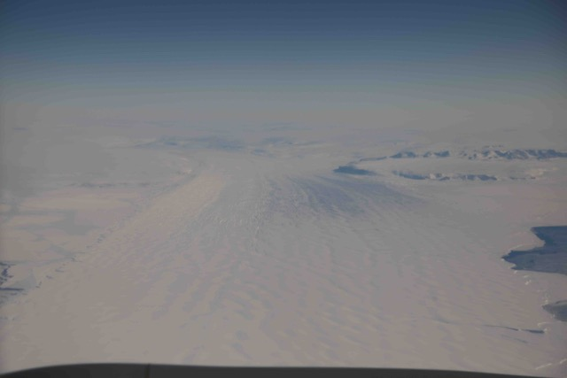

  

  

    
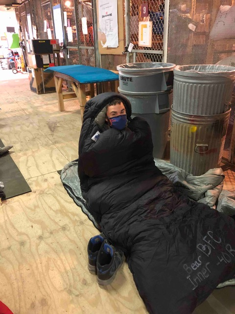

    
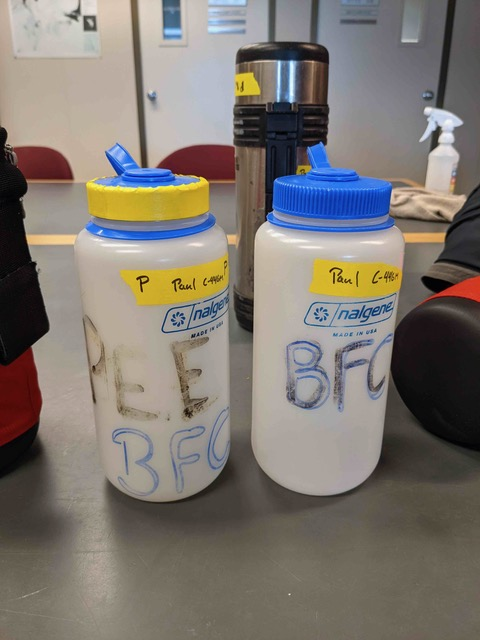

  

## Nov 9 2021

### Another update from 77.8419° S

Things are starting to ramp up here, we are about 1.5 weeks away from our scheduled flights out, so we are beginning to pack and send away our largest pieces of cargo. It's a little astounding how much stuff we are bringing, but I guess it makes sense given where we're going.

Some particularly noteworthy items:

- We use bamboo as tent stakes in the snow, we are bringing 80 pounds of bamboo for this purpose. 
- Our kitchen tent comes in 2 large bags, and weighs over 100 pounds.
- My sleeping bag (rated to -80F or so) wouldn't fit in my largest backpacking pack. I keep it in a 120L duffel bag with my sleeping pads.
- We are bringing over 300 packets of hot chocolate and cider. I'm excited for this.

An exciting event of last weekend though is that we did our "Shake Down" camping trip where we drive just outside McMurdo and pitch our tents as a test of the equipment and as a practice for how use it. I've thrown in a few photos from that below, including the crevasse rescue training we did after, it was very fun! I'm learning that Antarctica is really just like any other cold place you've been, just more so. The most notable change was how hard it is to get your temperature just right. The difference between being comfortable standing still and not overheating while walking is sometimes 2 jackets and a pair of over gloves. This means often finding myself sweating just from the exertion of something as small as unpacking my sleeping bag or staking out a tent. Unfortunately sweating means you get really cold really fast from the strong winds and difficulty to dry items here, so I will need to be more careful about adjusting layers before changing my activity level.

Today we finalized our full food plan for the trip, which I was in charge of double checking. It was fairly stressful for shop for 6 people for 3 months, but importantly we decided to triple how much chocolate we're bringing. Hopefully that will help everyone forgive me when it turns out I forgot something else important. Tomorrow we go in front of the teams here that represent search and rescue and risk assessment to get final approval for our field plan, which includes all of our safety plans and emergency plans for the coming season. Given that we plan on using chainsaws to cut up hard ice/snow to speed up our digging, I expect this to be an exciting meeting. Our mountaineers have been working closely with the safety team to make sure we do everything in a responsible and safe way, so it actually should be a fairly straightforward final run through of our plans, and is our final hurdle before we're officially approved to do everything we want to do this season! We still have over a week here, so hopefully I will have at least one more email update before I leave the internet behind. If there are any parts of Antarctic life you'd like to see in the next update let me know!

I hope you all are well! Love you,
Paul

p.s. photos and descriptions below

  

    
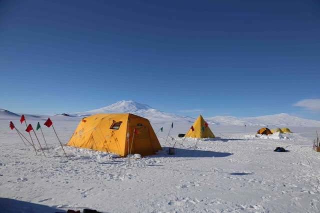

  

Our camp for shakedown! The big one is the "Arctic Oven" our main kitchen tent. We use all the guy lines, many tied to flags because we have lots of flags. We save the bamboo stakes (without flags) for sleep tents primarily as the flags are noisy in the wind. Down the line (away from the camera) is one Scott tent, a survival trench (for demo only, we all slept in tents) then 3 mountain tents. The prevailing wind is coming from the right side of this photo, though it was thankfully not very windy which is why the flags are calm. Mt Erebus, the 2nd most active volcano in the world, can be seen in the background!

  

    
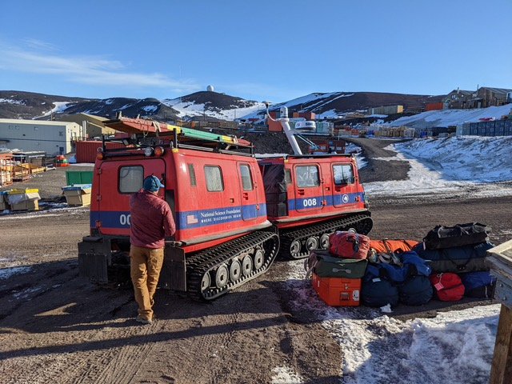

  

Sorry these are out of order here, but this is the car that brought some of our stuff our to the camp as well! It was very cute, but unfortunately we didn't ride in it. This was loading up at MCM before we went out. It's called a Hagglund, and they can even float at crawl through open water if the cabins are sealed well enough.

  

    
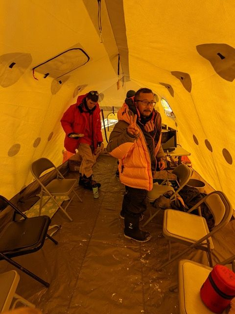

  

Inside of our Arctic oven! It's 2 walled, with the inner lining being a insulating, soft hand feel synthetic fabric, not far off a mid layer, but thinner and more durable. The lining is white, the fly is yellow typical fly material. The chairs and tables are borrowed from a nearby hut. We will have some in the field, but probably a different style

  

    
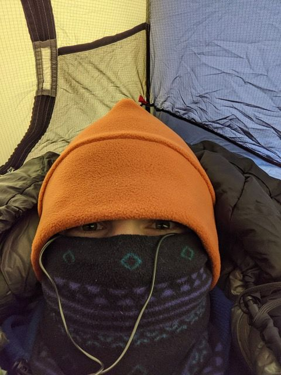

  

Me all bundled up ready to sleep! I ended up taking lots of this off after I warmed up, the big sleeping bags take a bit to warm up, but then are very very warm. I was in a mountain tent, but may try to swap to a Scott tent in the field, as I can stand up in a scott tent but not a mountain tent. I like standing.  

  

    
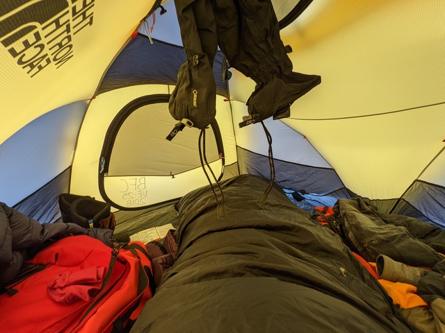

  

View of the room! A little tight b/c the sleeping bags are so big, and I think the pitching of this tent was a little sloppy which made it shorter too. It was the first we set up, and I'm glad we practiced for next time! I am diagonal to get the most length out of the pads, but I fit in the tent just fine. 

  

    
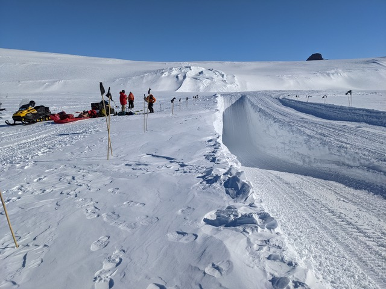

  

The crevasse simulator! A bullbozer made this big hole, its quite deep. We would walk around into the bottom then be pulled up, it was good to practice clearing the edge, and getting someone over the edge.

  

    

  

Mike, one of our mountaineers, explaining how to use a snowmobile as an anchor, since we'll be doing mostly snowmobile travel in crevasse areas

  

    
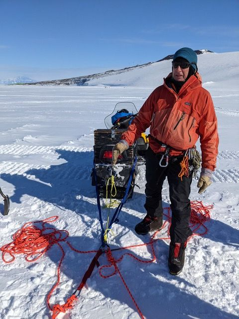

  

## November 14 2021

### Update #3: Blue Ice, Lots of food, and my first (stuffed) penguin sighting!

Its been a busy week this week, but there were definitely a few particularly photogenic moments. We had our second day of glacier training, which involved learning to drive snow mobiles (called ski-doos here), driving ski-doos while tied together incase one falls in, and importantly practice walking around known crevasses. Between you me and the fence post, we did this largely for the practice driving ski-doos to get here, but the walking in the crevasse was a wonderful cherry on top for the day! We will not encounter any crevasses like this in our field research. This feature is known as the IMAX crevasse for reasons that will later be apparent. 

We drove out to this site, it was about a 1 hour drive on ski-doos, 1 person per skidoo. We then transitioned to walking and looped around to this smaller entry section of a large and visible crevasse. This is right at a massive convex rollover where the slope transitions from about 10 deg slope to 30 deg slope below. Mike (a mountain guide( was leading, Danny (another PhD student) is the middle of our rope, me last.

Inside the first step down

After one more step, we came to this steep ramp looking father down, probably about 100 ft deep at this point, and running about 200-300 ft out in front of us until the crevasse closed up.

Closer to the bottom, we couldn't get all the way down due to a 10ft ice cliff at the very bottom. This is as far as we went.

Working on my selfies

Another view up to the ramp in a better view, this skylight is not how we came in, but did provide lots of light

After a day like that we all came back pretty excited to say the least! Otherwise the rest of the training went well, and we finished our final training, so we could begin some practice science days on the ice shelf here. Our first day had a few hiccups, but we have more days this coming week which I'm nervous but excited for. But before our science day, we did had one more final task: picking up, sorting, packing, and submitting ALL of our food to the cargo team. This is 3 full tables of food for us, ideally it will feed us 6 for 2 months, and includes (among other things) 100s of chocolate bars, an insane amount of pad thai noodles, and 10kgs of coffee. 

It took all 6 of us about 6 hours to sort, itemize and pack this all into these boxes that will be easy to find while we are looking for the last bottle of ketchup in the middle of a blizzard (a majority of food will be stored outside in these boxes next to our kitchen tent), as well as packing 2 boxes of "resupply food" to be flown in 4-6 weeks later. Coffee has an entire box to it self. We also have a similar amount of frozen food, maybe slight less, but that was also boxed and sorted, I just never got a good photo of it as I was on non-frozen food duty. You can't see the contents label on this photo, but I labeled the coffee box with a red arrow. Rest assured though, we will not starve and more importantly, as Piper will agree, we will not run out of coffee.

Another fun event this week was the so called "America Night" when Scott base, the NZ base 3 miles away, opens up its bar and store to US personnel from McMurdo. We usually aren't allowed because Scott base is about 1/100 the size of McMurdo and we would overrun the base otherwise. This mainly is because of the vastly superior stuffed animal collect at Scott Base, pictured here:

I now am a proud owner of a baby penguin, but I am still yearning to see one in real life soon! Its getting a little late here so I should probably get to bed and rest up for our science day tomorrow!

## Nov 20 2021

### Update #4: The Waiting Begins...

We had a busy again this last week as we finished up our science testing work on the Ross Ice Shelf and sea ice near town in preparation for our flight out to the field that was scheduled for yesterday, but has now been delayed at least a week due to weather. Its a bummer to already be running behind on our full schedule, but least you get another fun update from me :D

First some updates on the science experiment we are running. I'm helping with a radar survey, which the parts of are shown here. In the background above the wind screen by 2 flags is an antenna (on its side) and a small yellow box that is our transmitter. We then move away, anywhere from 200m - 5km away, and use the small orange box and another antenna (not shown) in the foreground as a receiver to record the direct path signal from the transmitter (directly along the surface of the ice) and reflection from the bottom of the ice shelf/glacier. Using information from these 2 signals we can learn about the properties of the ice we are surveying above like the temperature of the ice and the average orientation of the ice crystals. The black box is a laptop case, and the yellow box in the foreground is a backup transmitter and attached battery. This photo is from the Ross Ice Shelf, and the small black hill in the background is McMurdo.

When we are collecting the radar data, we set the receiver(s) to record for a few minutes (5-15) at a time, during which we just wait around basically. Here is Danny and myself waiting for the recording to finish up at one station. We have 2 receivers here and 2 antenna. Oddly laying down can help warm up your feet and toes since it gets them off the ice, which was Danny's problem that day. 

Otherwise, back in town life has been good! C-17 flights wrapped up this week which means less incoming mail/fresh food in the future, but they finished strong with this full size container of fresh avocados and lots of salad! The rest of the resupply flights now will be on the smaller C-130s which can land on a thinner sea ice runway. 

Thursday was Polar Pride Day, which featured many events and fun deserts, I hear the oreos were particularly good. 

Another fun activity this week was that we got a tour of the science aquarium. It is typically off limits to the public except for guided tours. Thankfully TJ from our group had breakfast with a PhD student, Aaron, working there and he agreed to give us a private tour! Here is Aaron showing us how to hold this little guy as he was the only animal that could bite in the touch tank. I didn't do too much touching, the salt water is very cold at 28F, but I did lots of observing, particularly of the sea spiders which are huge and very very cool. 

Here are a few of the larger sea spiders. They are related to the microscopic sea spiders found all over the world evidently, but they grow massive here for reasons this lab is trying to learn out more about. Specifically they are studying the relationship between water temperature and the early development of the sea spiders. The fathers carry the young around after they have hatched but before they are ready to set out on their own, which can take years. Things develop very slowly in the cold water. 

This little guy was a favorite of mine. I forget the scientific name, but Aaron called him Sonic, like the hedgehog. 

During the Sunday weekend today, Danny and I were lucky enough to grab spots in a guided tour of Discovery Hut (read more here https://en.wikipedia.org/wiki/Discovery_Hut). The stories of full winters spent in this cold, drafty hut (it was designed for use in the Australian Outback) make me feel very thankful for the warm housing and good food we have here! The hut is in incredibly good shape for being over 100 years old, and original rations from Scott's expedition are still there, preserved in the constant sub-freezing temps. I'm excited our field work will involve much less reliance on seal meat and burning blubber to stay warm!

That's all for this update! I'll be thinking of you all this week! Even though I'm afar, I'll be taking this thanksgiving to be thankful for such a loving and supportive family. Not to mention being thankful for heated buildings and hot showers while I still have them!

## November 27 2021

### Update #5: 1 month and counting...

We've had a noticeably less productive week here, but we've been doing our best to stay busy and/or mildly productive during our weather delay in McMurdo. One of our last tasks this week was fully packing our personal bags (ie not science or camping equipment, just clothes/personal items) to weigh them for the final touch to our cargo planning. This was a good time to realize you're missing 2 left socks and trying to remember where you put your favorite hat before we actually are scheduled to fly out. I've been  worried about having cold hands/wearing through my gloves while working, but laying out all my gloves has convinced me that I may have enough. I think the final count was 4x mittens, 15x gloves, and 4x liner gloves (I usually don't use these). I'm also trying lots of styles, so I'm sure I'll have recommendations when I'm back if you're curious.

Part of our weather delays included the first multiday "storm" that McMurdo has seen since we arrived. Just before the storm blew in the volunteers in the rec department put their best foot forward and scheduled a number of late night hikes to get the most out of our the remaining good weather. I was lucky enough to get a spot on a late night walk on the sea ice, and we were treated to this beautiful sun ring! These are caused by reflections of ice crystals high in the atmosphere and are often seen before storms move into the area. This photo was taken around 9pm we started our hike for reference, but it stays this bright all night this time of year, which means we could stay out hiking until 11pm no problem!

The next morning, as expected, a warm storm came into town. There were "light" winds of 20-30 mph, and snowed a few inches, though the snow quickly blows away and/or evaporates in the dry air here. There even was a few moments of graupel snow, more typical of warmer snow storms. The temps hovered around 25-30F for much of this storm which had me moving back into a "1 jacket" system when going between building. When its below 20 I've been tending to wear 2 jackets so this was a nice treat!

In preparation for the Thanksgiving meal, the galley was asking for volunteers to help with meal prep, and every member of my team was able to help out! Two of us got assigned to de-gutting 30 frozen turkeys for 2 hours, but thankfully I was assigned to peeling steamed butternut squash which was pretty fun! Here is my beautiful rack of peeled squash:

We've also been exploring the selection of board games available on base. We found a custom made, Antarctica themed Settlers of Catan board game, which was quite fun, thought the similarity of the colors of resources did make it confusing at time when buying items. The custom 3D printed game tokens of tents and propeller blades were very fun.

More updates on daily life here in response to Michelle's question, there is an OK selection of alcohol available at the store, here is a photo of the option this week. As you (maybe) can see on the left, the hard seltzer fad has even made it to Antarctica, and there are 2 flavors available here. I haven't tried them, but they seem popular.

[picture was lost :( ]

Friday night marked the beginning of the long weekend (2 days off in a row, what a treat!). To start off the weekend there was the annual Turkey Trot! I felt very out of place not being dressed in a onesie. Onesies I've learned are very popular here in McMurdo. I placed second to a very speedy penguin, who also happens to be the head of Search and Rescue. Next year I'll have to dress up as a leopard seal, and hopefully I'll catch the penguin, or at least put on a good show. 
 

Thanksgiving meal was served in 2 shifts, I went second shift from 530-730. The galley out did themselves with an incredible spread of every fixing, with vegan options abounding, and even a few gluten free desserts! My favorite was obviously the fresh spinach, which is likely our last "freshies" until February as heavy cargo flights are paused until the sea ice thickens again later in the season. We ate as a table of 7, the 6 for our field season and one of our mountaineer's partners joined us as well. It was different to be away from family this year, but it was still a joyful meal that reminded me how much I have to be thankful for here and in life at home! I hope you all had wonderful thanksgivings of your own :) 

In a completely unrelated and more practical update: The question of how we do... doo-doo here has come up and I thought to tell all those who are curious! In McMurdo where I am now we do have plumbing, so its business as normal for end users like myself, BUT it all gets processed in a waste water facility, and ALL waste that can't be reused on base (like grey water) is shipped via vessel back to the USA for disposal. Specifically it goes to a port in the LA area and then is incinerated I believe.

For most field sites, bio-degrading in the soil is not capable of dealing with any human waste, so all waste (poop and pee!) is collected and brought back to McMurdo to be then processed at waste water or ship it back to the US. This is one example of how and why Antarctic expeditions require so much logistics! 

For some camps though, which includes our camp, limited waste can be left behind. Because we are a small camp in the "accumulation  zone" where there is net snow fall every year and everything gets buried by meters of snow each and every year, we are allowed to establish a waste area. We report the exact locations and estimated contents of each site back to the field coordinators that track the total impact of humans on the continent. This waste will not decompose, but will be buried in ice for 1000s of years which is almost the same thing I guess? Practically this means that we will have a toilet tent that is sheltered from the weather, but not heated, for pooping, and a "sump" flagged area for liquid waste (pee, tooth paste spit, dish water, etc). All other waste like trash/food/etc will be sorted and packed out.

So, I'm not really complaining about being 'stuck' in McMurdo for this time, but with the weather shaping up this coming week, I'm excited that we may soon be getting ready to fly out to the field! I'll likely still have time for one more update though, so hopefully you're not too annoyed with my updates yet :)

## Dec 4 2021

### Update 6: Almost there!

Exciting news! The WAIS camp crew was able to fly in on Monday (Nov 29, 21 days delayed) and our mountaineers flew in Saturday which means we will likely be following them soon on flights of our own. Possibly as soon as tomorrow, but more likely Wednesday for me. I've also been forgetting to mention it, but our team has been writing a blog which has more fun updates on our trip and photos, you can find that here: https://studyearth.wixsite.com/thwaitestime/blog. Since I will be moving off email when we leave for WAIS, I thought I'd spend an email talking about everyone's favorite topic:

LOGISTICS. (but also some fun stuff at the end, I promise)

This will also help you make sense of my GPS points as I send them.

Our first flight is to WAIS Divide Camp. 
79°28′03″S 112°05′11″W
[https://en.wikipedia.org/wiki/WAIS_Divide](https://en.wikipedia.org/wiki/WAIS_Divide)
We will likely spend 1 week or so here before going into our field site (TIME1), and then again about a week on our way out from the field. WAIS Divide was established in this location to drill a very, very deep ice core of 3,405 meters. Thats right, over 2 miles of ice will be beneath our feet when we get off the plane. At this depth the ice crystals here originally fell as snow 67,748 years ago. This site was chosen for being such a deep section of old ice. It has notoriously poor weather, and as such is not ideal for the international flight hub it has become now as drilling was ceased in 2013. 

As I mentioned before, this region is in the accumulation zone, so net snow fall accumulates every year. This means that anything, including major buildings like the drill building complex, attached to the surface will inevitably be buried. Now almost 10 years later, the drill building (yes this one https://en.wikipedia.org/wiki/File:Antarctica_WAIS_Divide_Field_Camp_16.jpg) is completely buried in snow, impossible to enter, and abandoned. This was always the plan, but it is still an impressive display of the power of nature. Evidently it is a fun target to look for with Ground Penetrating Radar (GPR), as it is a massive, metal, hollow, target which is about the easiest thing to see with GPR that you could imagine. 

We will be flying to WAIS on a roughly 5 hour direct flight on a Basler BT-67 (https://en.wikipedia.org/wiki/Basler_BT-67) which a remanufacture of a DC-3! We may even fly on the one on the wikipedia page (https://en.wikipedia.org/wiki/Basler_BT-67#/media/File:Basler_bt67_antarctica.jpg). There are at 2 of them here this year, so thats a 50% chance I'm on the one shown there! Unlike the paratroopers who flew DC-3 (or C47s, a military variant) in WWII, we (thankfully) will not be jumping out of them when we get to WAIS, instead we will have a very nice, ski-based landing on a prepared skiway. 

Any who, back to the plan.

Once at WAIS, we will embark on a long list of flights on twin otters (https://en.wikipedia.org/wiki/De_Havilland_Canada_DHC-6_Twin_Otter). These are campable of landing on unprepared, but flat, snowfields which makes then very useful for landing at remote sites. We will have 6 flights at least to place items at TIME1 (see my map below), 6 flights at least moving items from TIME2 to TIME1, and undoubtably a few more weather delays. We will be making day trips via plane (twin otter) from WAIS to TIME2 then shuttling equipment via plane (twin otter), mainly snow mobiles aka skidoos, to TIME1. The current expectation is that we can do 3 of these shuttles in one day with one plane, TBD if thats actually realistic. Our mountaineers are scheduled to start this processes tomorrow!

Once all equipment is shuttled from TIME2 to TIME1, we will then start doing our full put in of 6 flights of supplies to TIME1 from WAIS. Our Mountaineers and a more experienced team member (His name is TJ)) will fly first to start setting up camp, and doing some safety surveying of the area. Danny and I will likely be on the last flight flight, and probably the first ones to come back when we return. Much like when I played soccer, we will be the "sweeper" keeping everything together. This means we'll be familiarizing ourselves with our cargo priority lists as we'll be the ones organizing and sending off the later flights, and making sure we don't leave anything extra behind at WAIS when we take off. It takes me 2-3 tries of walking out my front door, and then back in before I actually remember everything for work on a typical day, but thankfully Danny is much better at lists then me. 

TIME1 is the main field camp we are going to this year. There currently is nothing there but snow and ice, so we're bringing in everything we need to eat, sleep, survive, and thrive. We additionally are tasked with recovering the 7 seismometers, 6 GPS stations, and 2 Radar deployments that have spent the last 2 years being buried in snow nearby (see inset maps, TIME1 A-G are 'our' seismometers, T1a-d and M1a,b are GPS stations, radar installations are not shown). There is another team deploying through the British Antarctic Survey (BAS) that is doing the same for TIME2 sites. We're all friends, and hopefully we will toast the queen with them when we all unite at TIME2 at the end of the season. 

Our plan is to spend a majority of our time recovering all the instruments around TIME1 in day trips (via skidoo). This includes T1a-d, TIME1 A-G, M1a, M2b. M1c and M1d are just bamboo sticks that we'd like to find for surveying purposes, but we expect are lost to the snow. The GPS stations are measuring exactly how fast the ice is moving at these locations, and if the speed is changing at all over the observation period. The color scale on the maps below shows surface ice velocity as measured by satellite which is a great estimate, but is only accurate to +/- 10 meters per year or so. GPS velocity measurements should be accurate to millimeters per day, or about a million times better precision. 

We will also be doing a radar survey on the transect at TIME1 that is red and labeled "Bistatic" in the key. You may see a nice little patchwork of me checking in on my InReach, but may also forget or get lazy, so I apologize in advance if I leave spots off my GPS check-ins. 

The final fun touch of our season is that next year everything needs to be at TIME2. This means that we will finish our season traversing the 100+ km between TIME1 and TIME2 via skidoo, with all 10,000+ lbs of our stuff to return it to TIME2. Ideally a Twin Otter will actually pick up much of our science cargo from TIME1 before we leave, and bring us a resupply of food, but plans to have a funny way of changing here it seems. This will means each of us 6 will be on our own skidoo, towing 2 sleds each of which is about 12 feet long. Thankfully the route is quite straight as you can see from the map (we follow the "safe routes") as turning will be difficult. 

In other news, December here means high summer! We had our first day of above freezing temps, with full sun to boot. We celebrated by getting out for a ski on the sea ice. The flat, smooth surface makes for ideal cross country skate skiing. There was a rumored penguin out on this loop Wednesday, but despite by best efforts I didn't spot it. Below is our mountaineer Mike on route, you can see observation hill (which sits above McMurdo) just to the right of him.
 
Yours truly enjoying the views of Mt Erebus in the distance. 

Yesterday we also had the distinct pleasure of viewing a partial solar eclipse! Our mountaineers (Mike and Kirah) we able to fly to WAIS which saw the TOTAL eclipse, I was quite envious and tried to sneak into their carry on bags, but alas I was too heavy. I blame it on the on the cookies. They took pictures, which I'm eager to see when we meet up with them, hopefully soon! Back in McMurdo, the recreation department organized a large group outing onto the sea ice to view the eclipse there. I hiked a ridge line near McMurdo, and it was fun to see all the people on the ice

We brought eclipse viewing glasses from home and were sure to carefully use them, it would be a big bummer to go blind just before flying out the field! I also got a little creative since I left my camera filter at home, but holding the glasses in front of the camera did appear to work pretty well! This is about maximum eclipse for us.

More advanced photography techniques here, but again I was pretty happy with it! You may have to zoom in to see the sun/moon, but it is there! The weather was stunningly clear after some earlier clouds in the area had us nervous. However, it was incredibly windy. Being on a ridge certainly didn't help, but we had sustained winds of probably 30 mph on the ridge which made walking on the loose rocks quite a challenge. 

To answer a question from last week, exercise and self care is a very important part of life down here! There is a full time PT on station, and a counselor as well. There are 3 gyms of a reasonable size, they feature more weight machines than I've ever seen, and lots of indoor cardio options. Additionally there is a large group fitness room where classes are held weekly for HIIT classes, yoga at all levels, kickboxing, pilates and some other classes I'm probably forgetting. The Rec department also has lots of equipment available for rent (for free!) including mountain bikes, fat tire snow bikes, skis and yak-traks for hiking on ice. The Rec department additionally has volunteers that lead hikes and other non-eclipse related activities. I'd say in general, most people tend to exercise a few times a week between hiking on good weather days, especially weekends, and the gym on other days. Most people working here also have fairly physical intensive jobs, so that also counts as exercise, but staying well balanced in the gym an important injury prevention step as well.

Thanks for bravely reading through this longer than usual update, but I hope it finds you all well! I am not sure I'll be able to send another update before I head out to WAIS and TIME1 where I will have no email, but keep an eye on the mapshare link for updates on where I am:

[broken link]
[pw]

I will miss you all this holiday season, and I am sending you all my love and best wishes! Drink an extra serving of hot cocoa for me this year, and take a moment to be extra thankful for the family and warm walls around you!

## Dec 15 2021

### Update 7: Overdue update

Apologies for missing my normal schedule! Unfortunately the delay is not due to me being out of internet yet, as we are still in McMurdo. There is a saying here that Antarctica is "a harsh continent" and we've particularly been feeling that this week. In addition to the record setting weather delays we've been experiencing for opening the WAIS Divide camp this year, a staffing shortage has led to a 3 week delay in the largest on-continent planes (LC-130s, ski outfitted C-130s, very cool planes) arriving. These planes are critical for ferrying cargo, people, and importantly more fuel to the WAIS Divide camp that is the main hub for science in Western Antarctica. The combination of these 2 factors has had a significant impact on the entire program in Western Antarctica, the full scope of which was becoming obvious writing on the wall right after my last update, and was formalized to us on Tuesday. 

Our season, originally planned for 59 days in the field, is now scheduled to be 10-14 days (weather permitting) which is quite disappointing. This tragically results in the cutting of the radar project I was most involved with, and means that we likely will be abandoning almost half a million dollars of seismic equipment in the field to likely never be recovered from under the increasingly heavy cover of snow. Hopefully we will be able to recover the data off of these devices at least by quickly digging to just the data ports of the boxes, but we do not expect to have time to fully recover the entire mini-fridge sized equipment boxes. 

As sad as this update is for us, I do still consider us lucky as 2 entire science programs in Western Antarctica were entirely cut at the same time. One of those groups, Polenet, is remaining here to do other work in the McMurdo area. The other, AWS is packing their bags to immediately go home Monday after only a short time in McMurdo, which is very sad, but they are hopeful to be home for Christmas at least. Needless to say it has been a particularly hard season for USAP in Western Antarctica. Everyone here has worked incredibly hard to give us the opportunity to continue on with our season in spite of these unexpected challenges, and we are very thankful for their hard work. That said, we're all still keeping our fingers crossed as we still need some good luck to come our way for us to actually make it out there!

In the meantime, we are continuing to live in McMurdo with all of its daily excitements, and we've been busy repacking our food/cargo/science gear as we need less to eat, and need less science equipment as our season's plans have changed. Some highlights from the last week include:

My first 911 call ever. 
I was maybe a little too excited for this, but a trash can (a 55 gallon drum) devoted to cigarette butts was heavily smoking, and as fire is a major risk here I was quick to call the fire department. Despite how clear I was on the small size of the 'fire', they sent out an ambulance, a whole fire truck, and evidently an odd man out who appears to have just walked/run over from the fire house on his own? (its a short jog away). It sounds like this type of call is pretty common for them, as they have a water pitcher sized to pour water into the drum on their truck. It ended up taking a good few pitchers, and eventually they dragged the drum over to the truck to pour straight from the spigot into the drum. I filmed it all, after they encouraged me to of course, it was pretty fun. I especially appreciated the FULL outfits they all put on.

Race 2 of the Antarctica Race Series, the 10k! 
I placed 2nd again to the same speedy penguin, Scotty. He wasn't dressed in a penguin onesie this time, just particularly shiny thermal leggings. I was just a little jealous this time. It was quite the headwind on the uphill this time, where I was able to keep up with Scotty, but on the fast tailwind downhill I was reminded at just how long its been since I've tried to run that fast. It was still a very fun race, and I've enjoyed the race series a lot but I really hope I'm not around for the Marathon next month! 

Christmas decorations are starting to show up around town, which is very fun. The Science Building, Crary Lab, has my favorite tree decorations. From the sea spider ornaments to the seal-tag garland they have many many fun themed science tidbits on the tree.

Even the gear supply department (the Byrd Field Center, BFC) has put a Scott Tent for Santa (and me).

One of the science cuts we had to make was to not bring a set of 24 small seismic nodes (I'm holding one below, Danny is drinking tea), which record vibrations in the surface snow/ice for about 30 days until their batteries run out. (These are basically smaller/cheaper versions of what we were/are hoping to dig up at Thwaites). We were planning to deploy them at Thwaites, but due to limited time and cargo capacity, we cannot bring them out. To still get some science value out of them while they (and us) are here in Antarctica, we spent yesterday deploying them at the same location that we did our radar survey earlier on the Ice Shelf.

It was our first outing on the ice without our mountaineers, which was a little exciting, but thankfully went quite well. It was my first time helping with a seismic experiment, but I quickly learned that I was pretty good at it, as it is mostly just digging small 1'x1'x1' holes in the ground. Or at least that was my part. After all the nodes were carefully orientated (their 3D orientation is critically important for processing), turned on, then buried in 6" of snow, we then made some "active" sources of seismic noise. Explosives are a common source, but there are a few other ways of doing this cheaply and safely, though maybe less exciting. The one we selected was slamming a 12 lb sledge hammer into a 10 lb Aluminum plate laid flat on the ground (AKA "Hammer Time"). I of course volunteered for this. I wasn't great at the start, with some "double strikes" and off center hits, which make less crisp sources of noise, but by the 80th swing or so (we did a lot) I finally had it down. 

The point of these strikes is to make a loud, short, sharp sound that the seismometers will hear directly, but also make echos of when the sound bounces off the bottom of the ice shelf where it becomes ocean, as well as an echo off the ocean floor beneath the ice shelf. The site we placed the nodes at is also quite close to the airport, so the team here is hopeful that they can see the noise from planes landing on the ice shelf runway as well, which sounds pretty cool to me!

As for our flight outlook, we still are hoping to get out to WAIS Divide and Thwaites Glacier soon! We have our last cargo flight scheduled for tomorrow (Friday), and our passenger flight scheduled for Saturday. I've definitely said that a few times before, but one of these times I know we'll actually make it out! Until then, we'll be keeping out bags packed, our spirits high, and staying thankful for the support of the people here and our friends and family afar.

Love you all, and wishing you all an early Merry Christmas!
Paul

## Jan 12 2022

### Update 8:

Hello from McMurdo again! 

After much drama and worry going into this season, we were pulled out of our field site on Jan 4th to WAIS Divide and then back to McMurdo on Tuesday Jan 11th. After all the weather delays for us getting to the field, we had incredible weather for the 13 days we were out. For a region that typically has 15-30 knot winds and overcast skies, we had 12 of 13 days of nearly cloudless skies, and never had winds above 15 knots. We couldn't have asked for better weather for working, and because of this we were able to recover 100% of the buried equipment and data, except for a few cables and metal poles. The radar experiment I was working on needed 6 days to complete, but we made the most of 3 days we had available. This is much better than the 0 days we were expecting for radar, so I'm very happy with what we were able to get done.

We are now in McMurdo for about a week. Hopefully, we're scheduled to fly to NZ on the 19th. But as with all flights here, there is a pretty good chance that may change. Until then, we are processing our equipment here, repacking, cleaning, and returning borrowed camping and science equipment, backing up all data in triplicate, and deeply washing all our clothing.

I'll save you all the long story. I kept a field journal and we all shared photos (over 2000 of them!) if you're curious for more details, but below are a few fun photos and descriptions!

Yours truly with the Basler, the plane we flew to WAIS Divide on. It was a smooth flight complete with coffee and cookies, which was very unexpected. You did have to pee in a bottle on this flight though if you couldn't hold it for 5 hours.

WAIS Divide! These are some of the semipermanent tents and structures they have established here complete with heaters, showers (2 of them!) and a washing machine. These were quite nice to have when we came back here! 

A twin otter landed at our T1 site! These are the smallest planes we flew on. It took 5 loads of them to bring all our stuff in, and 7 to take us out with the extra equipment we dug up. This view is also very typical of the time we spent at T1. Its is called the "flat white" as it is 100% flat, 100% white, and 100% without variation all the way to the horizon. Because it is so flat, you can only see about 3km in any direction. We typically worked 5-15km away from camp, so often all we could see around us was white snow and blue skies. 

Speaking of camp, here is our camp! These are our sleeping tent and toilet tent. This photo is from our worst day of clouds. You couldn't see anything in any direction as everything was completely flat, white light. This is very typical for the region and makes travel/work difficult and flights impossible. We were very lucky to have this for only 1 day.

Our kitchen tent and some personal baggage, with our cargo lines of storage and snowmobile farther right

A look inside the kitchen tent! Outside temps averaged around -10C to -25C, but inside the tent with 6 people and stoves running got as warm as +10C! It occasionally went below 0C in our kitchen tent, but this was pretty rare. 

Speaking of field work, I'd mentioned that we were concerned about our sites being fully buried and very un-findable, Here is Marianne standing next to a pair of 8ft tall bamboo flags planted 2 years ago. As you can tell, we came just in time! We came to realize a few of these flags had fallen over due to strong winds (oops) which required significantly more sleuthing (aka using ground penetrating radar and "exploratory digging") to find. Thankfully most did not fall over.

The largest instruments were installed with 12 ft tall solar panels, which were much more visible. Here is Danny in a shallower hole we dug to recover a seismometer box and TJ on the surface.

Our digging was sped along by the use of a chainsaw, operated by our 2 field guides Mike and Kira. They would cut up the snow like a "tray of fudge" as Mike put it, which we would then pop blocks out of to throw on the surface. This was a MASSIVE aid to us and saved us lots of struggling in icy snow with shovels. 

The final result of another dig, you can't see the bottom from this side! We dug up 7 seismometer data boxes, 7 seismometer sensors (buried deeper and 10-15 ft away from the data box), 6 GPS and 2 Radar stations at T1. It was a lot of snow to throw around! 

Once we were done at T1, we were picked up by 2 Twin Otters to be brought back to WAIS Divide. After being alone for 2 weeks, it was quite the treat to be doted upon by 2 aircraft!!

Back at WAIS Divide, we then had to repackage all our recovered cargo for shipment back to McMurdo on LC-130s. This was quite the task with disassembling of all the solar panels, sorting all the sensitive electronics, and waste batteries into separate categories. The British team at T2 also sent all their cargo to WAIS, so we processed their cargo for them as well. This was made additionally challenging by the fact that all this futzing with bolts and batteries and sorting was done outside in -20C temps. Thankfully the light winds kept the wind chill above -30C, relatively pleasant for WAIS! I must admit I have a new found love for impact drivers/ hammer drills after struggling with hundreds of frozen/fused bolts in these conditions. 

Before we went back to McMurdo, the British had not been able to recover one of the 7 seismometers at T2, a $30,000 piece of equipment. We were able to get a day trip on a twin otter to fly to T2 just to recover this, which was exciting! This day had our worst weather of the entire trip with 30 knot winds, blowing snow, but warmer at -8C or so as T2 is lower and closer to the coast. Its telling of how good our weather was this trip that we landed a plane on an unprepared surface ("open field" landing) in the worst conditions we ever saw. Unfortunately, the snowfall is higher at this site, and so we had a lot more digging to do, even in the wind and blowing snow. We also had to dig a wider hole as the exact location of the seismometer wasn't well known, here is Danny, Jessie (a Twin Otter Mechanic who came along to help dig) and Marianne standing in our beautiful hole, about 8-10 feet deep, complete with a dusting of blowing snow.

This is the view from outside that hole, you can see some of the drifting snow, though the video is more telling. We built a wall upwind of the hole with blocks from the hole, which thankfully blocked most of the wind and blowing snow. 

Once we finished our extraction of the T2 seismometer, we did some final packing and prepared to board the LC-130 home! Here is it idling on the skiway at WAIS, the big sled and tractor behind it are used for loading cargo onto the plane. We boarded through a passenger door on the left side near the nose. The keep the props spinning for all of this as they can't reliably re-start them at WAIS (its too cold!). Boarding a plane in front of its massive, spinning propellers was a little exciting and non TSA-approved, but thankfully none of us were sucked in. 

And here we all are buckled up and ready to fly to McMurdo! The LC-130 is much faster than the Basler, taking only 3hrs to fly to McMurdo and features 2 bathrooms. We never got any briefing on how to operate them though, so I actually never had the pleasure to use one. Unlike passenger planes, all of our flights in Antartica have been very, very loud with ear protection required. I do have ear plugs in here, don't worry, I didn't find the over-ear ones to be as comfortable as the others did.

