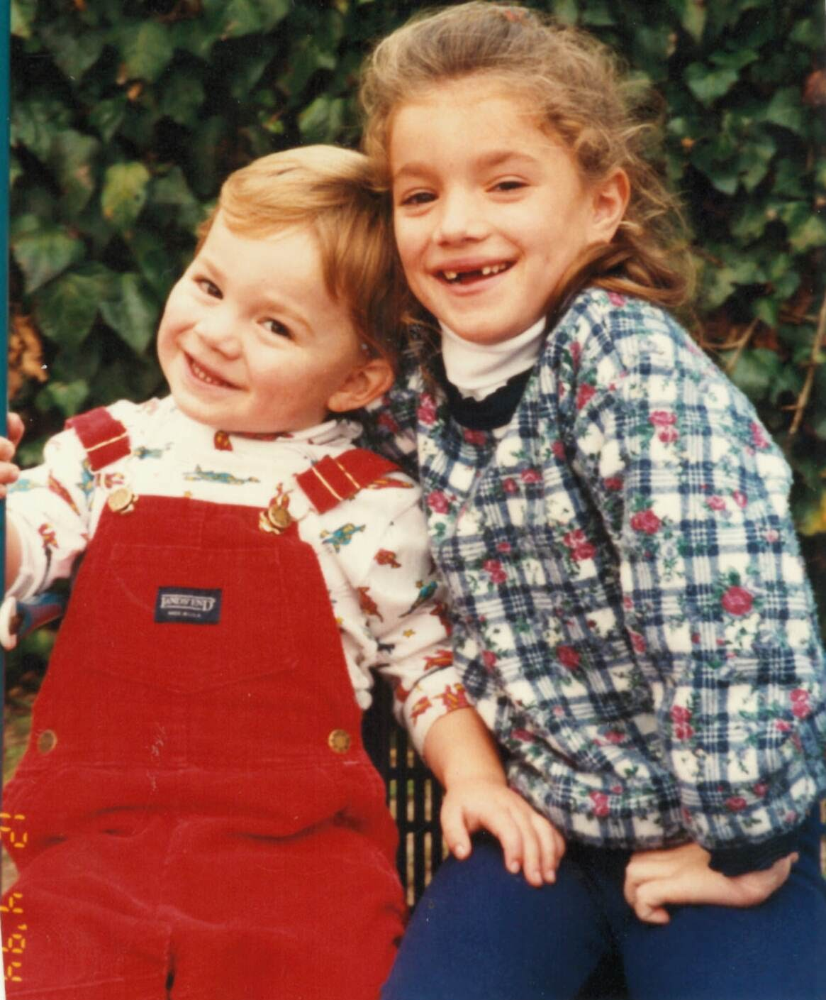
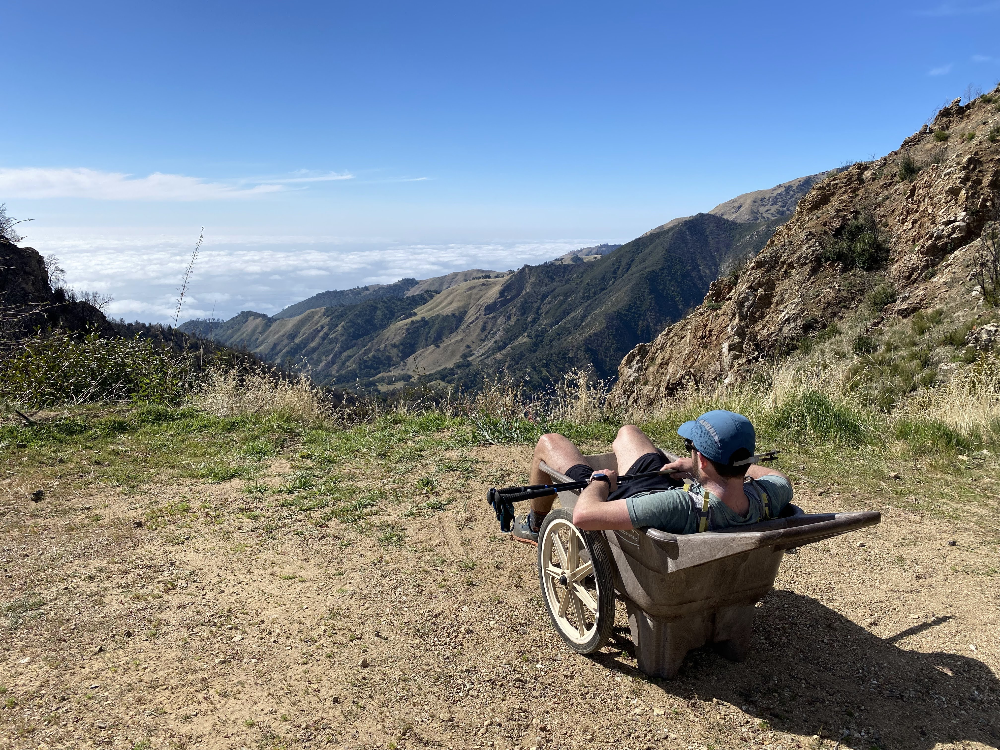
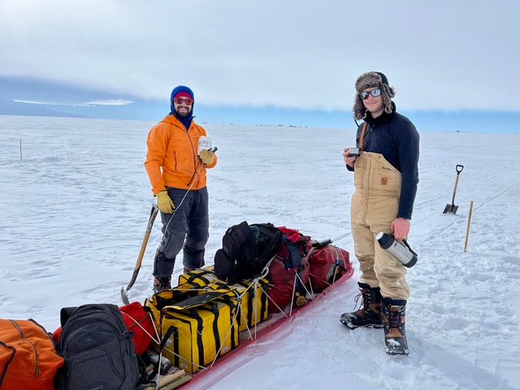
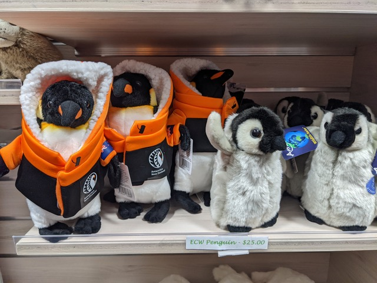

  

    

    

    

  

I am a Postdoctoral Researcher based at Georgia Tech and working with Rutgers University Department of Marine and Coastal Sciences. In my research I use numerical modeling to modeling ocean circulation beneath a dense mélange pack within a fjord, including effects on melting of icebergs at the ocean interface. My PhD was focused specifically Antarctic Glaciers and their lateral boundaries. I discovered my passion for exploring and understanding the natural world when I was young through hiking day trips, backpacking at summer camp, and through scouting. In high school, I was drawn to math and physics and how these subjects could be used to explain the dynamics of the world around me. In undergrad, I continued my journey with a BS in Physics while also applying this physics tool set to the natural world, earning an MS in geophysics. 

<!-- After undergrad, I took 4 years away from school to work in Tech in San Francisco, before ultimately returning to school for my PhD at Stanford with Jenny Suckale particularly motivated to study glaciology and the rapidly changing cryosphere. I was drawn to Jenny Suckale's group at Stanford for her process-based, physical modeling approach, and strong collaborative approach to working with local communities to ensure our science is as impactful as possible.  -->

I now work with Alex Robel (Georgia Tech) and Becca Jackson (Rutgers) focusing on ocean/glacier interactions in Greenlandic fjords on the GLACIOME project. I am excited to broaden my academic experience working with ocean modeling. I additionally and very excited to join the vibrant cryosphere community at these institutions.

I hope to continue my career as an educator, aiming to provide accessible, engaging and enjoyable learning opportunities to students. I have developed and practiced this as a teaching assistant in Geophysics, teaching apprenticeships in the Stanford Outdoor Adventure program, and through engaging with the Stanford Center for Teaching and Learning. 

<!-- 

     

     	  

          

     	  

     

 -->

