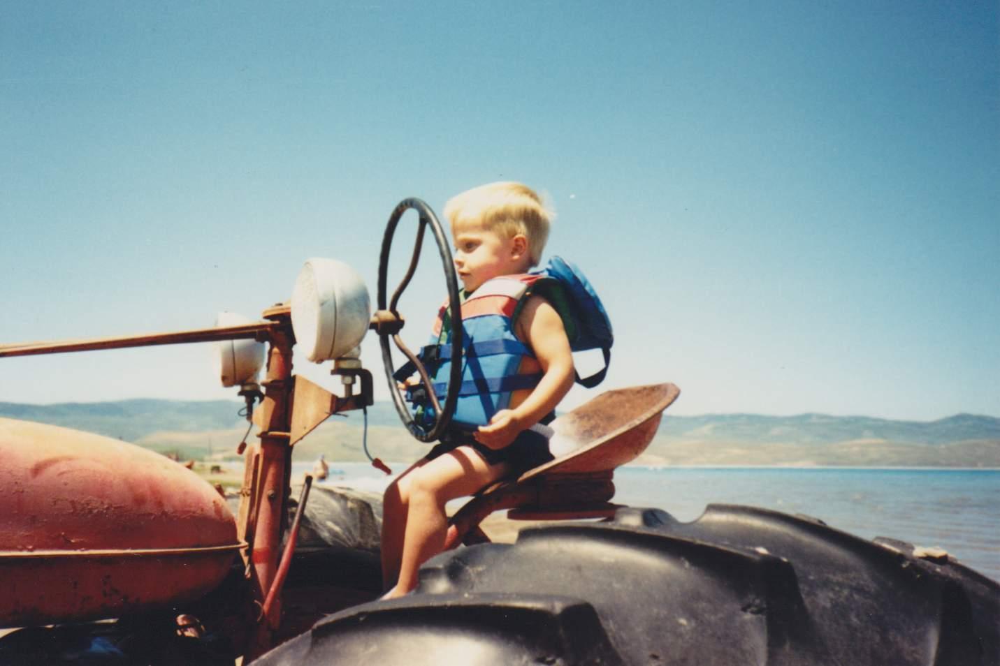
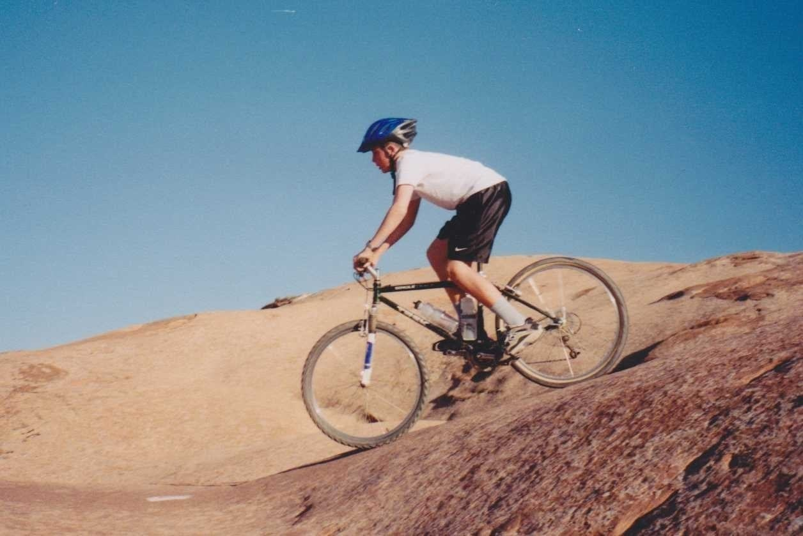
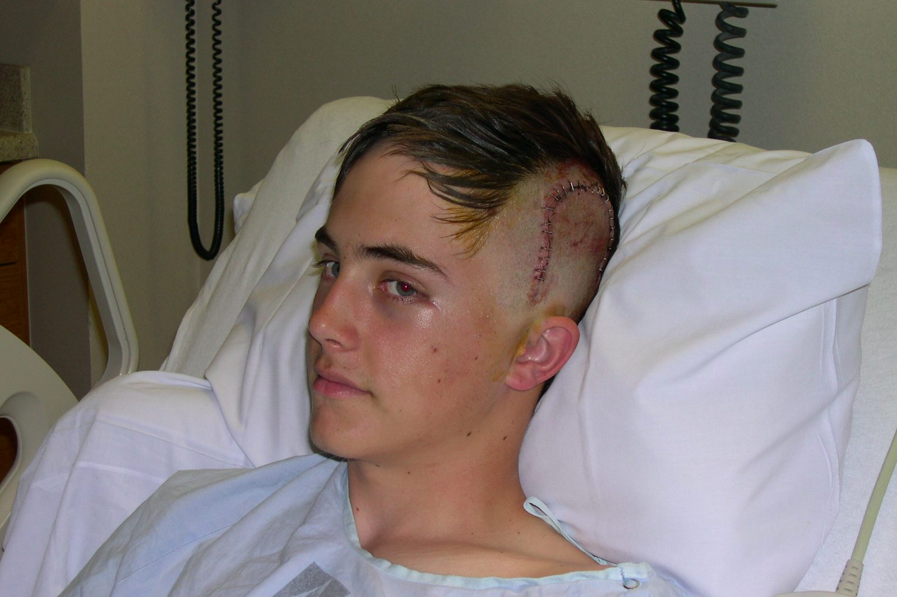
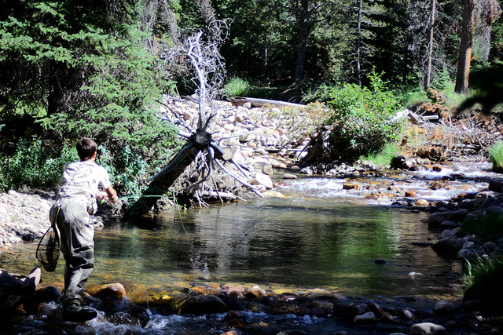
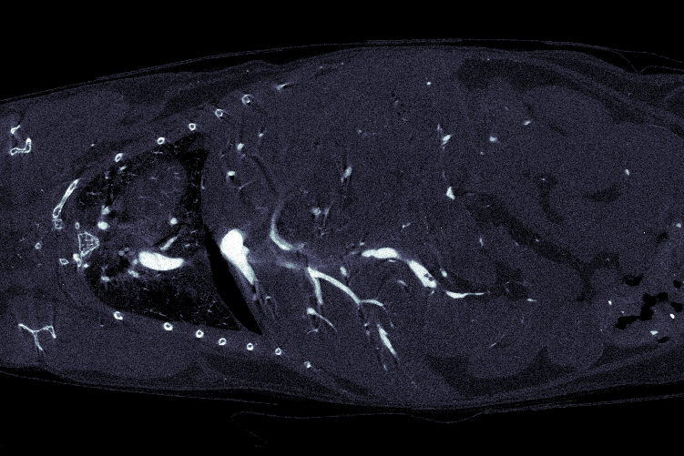
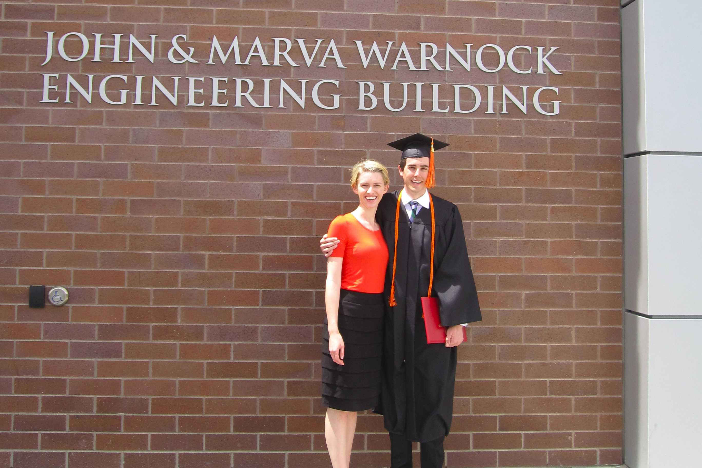
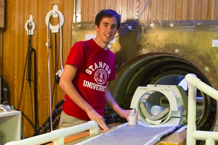
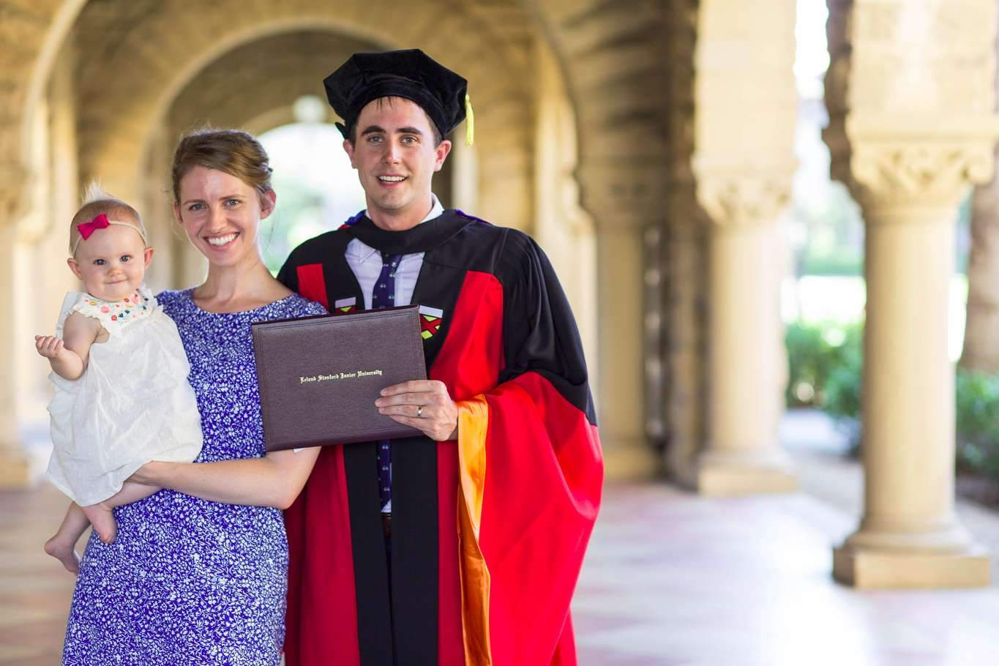
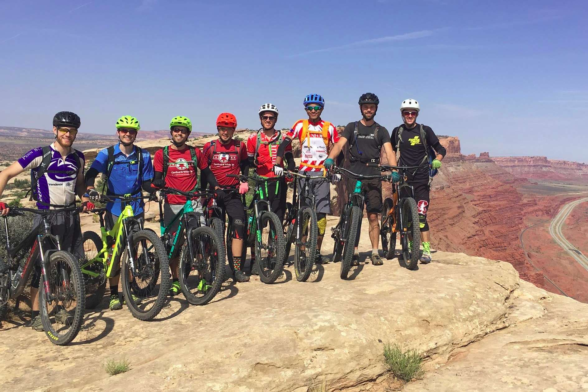

  

    

    

    

  

I am a multi-generational Utahn.  I grew up in Davis County, Utah.  My dad, being an engineer, stressed analytical thinking in problem solving.  Ultimately, my interest in signal processing was sparked during a car stereo installation when I was in high school when my dad explained how speaker crossovers work. Importantly, I developed a deep appreciation of the West, particularly skiing the Wasatch, fly fishing in the high Uintas, and mountain biking in the red rock country near Moab.

Growing up, I spent a lot of time waterskiing.  My family would be on the lake as long as the ice was melted.  I have water-skied in northern Utah every month of the year except January.  To get the smoothest water, we would be on the lake as the sun would be rising above the mountains from the west.  On Memorial Day 2004, my family was boating at Willard Bay.  I crashed hard, causing the ski to hit the side of the my head.  After being rushed to the emergency room, a CT scan revealed that the left side of my skull had been shattered, requiring an emergency craniotomy.  The surgery went well, though the injury initially left me unable to read, write, and even string coherent sentences together.  Defying the prognosis, my recovery was relatively fast.  The timing was also fortunate, as I had the entire summer to recover before my senior year of high school started.  After six months, I was symptom free and doing well in the classroom.

     

     	  

          

     	  

     

I attended the University of Utah from 2005 to 2011.  During this time I took a two year break for ecclesiastical service in Taiwan.  After my head injury, I became very interested in biomedical engineering.  I majored in BME with an emphasis in electrical engineering and a minor in pure mathematics (yes, I had to take a full year of analysis).  While at Utah I developed a passion for teaching after being the lead TA for the upper division and graduate level bioinstrumentation and signal processing courses under Prof. Ed Hsu.  During these years, Prof. Hsu and I significantly revamped these classes, particularly the laboratory sessions.  Several years later many of these labs are still in use.  I also had the chance to work as an undergraduate researcher in Prof. Hsu's lab where I completed my senior project "Correlation-based retrospective concatenation of multi-volume 3D microCT data."  I found the technical challenges and the real clinical impacts of imaging to be very interesting.

I decided to pursue a PhD after college.  At the time I had hoped to continue in signal processing.  Tori (then my girlfriend and now my wife) was at Stanford Law School.  We felt it made sense to be at the same place, so I applied to Stanford for my PhD.  I was fortunate to attend Stanford as it was very strong in medical imaging, particularly in MRI.  In grad school I studied under Prof. John Pauly in electrical engineering working on body diffusion-weighted MRI.  My PhD spanned most aspects of MRI, including biophysics, MR physics, pulse sequence design, RF pulse design and power deposition analysis, reconstruction algorithms, numerical simulation, and clinical implementation.  My thesis was titled "Robust body diffusion-weighted magnetic resonance imaging."  While not in lab or at home I spent a lot of time on my bicycle.  I began amateur road bicycle racing, seeing much of California in the process.  As grad school wound down I spent more time on my mountain biking, enjoying the awesome trails in the redwood forests near Santa Cruz.

Teaching was also core components of my Ph.D.  I was fortunate to secure external funding through the National Science Foundation Graduate Research Fellowship Program for the majority of my graduate studies but elected to serve as the lead teaching assistant for multiple courses and twice acted as the primary instructor for a summer quarter class in Electrical Engineering.  In those capacities I held office hours, graded, and lectured.  (Teaching evaluations can be found at \url{ekgibbons.github.io/teaching}.)

During graduate school I became interested in artificial intelligence and how to apply these new technologies to interesting engineering problems.  To put my knowledge into practice, I worked as a deep learning engineer at MedWhat (an artificial intelligence medical assistant) while I finished my PhD.

After grad school, my family returned to Utah for me to work in the Utah Center for Advanced Imaging Research as a post-doctoral scholar working under Ed DiBella.

  

    

    

    

  

