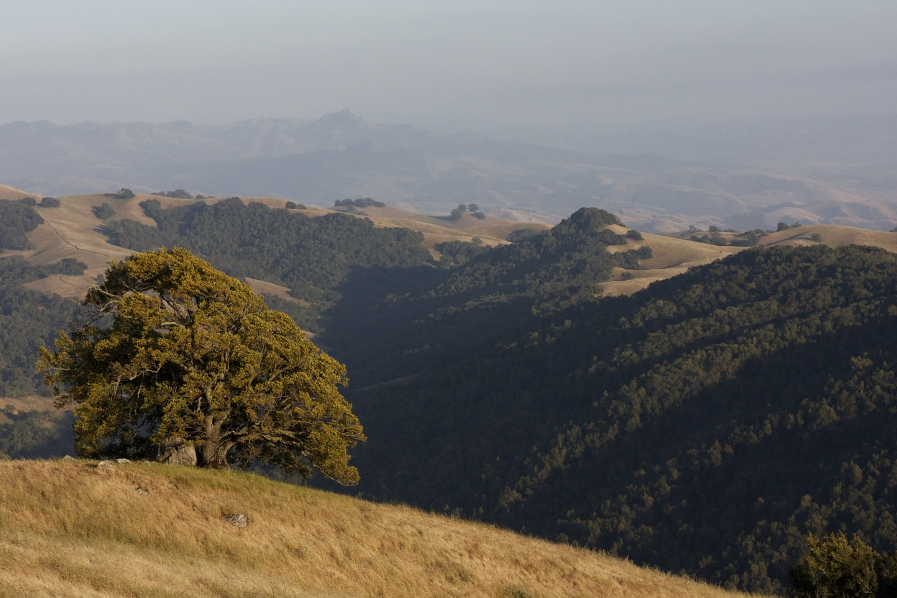

  

    

    

    

  

I am a PhD Candidate in Geophysics at the Stanford Doerr School of Sustainability. I am also a Bay Area local, growing up in Palo Alto. I research the mechanics of Glaciers, specifically Antarctic Glaciers and their lateral boundaries. 

     

     	  

          

     	  

     

  

    

    

    

  

