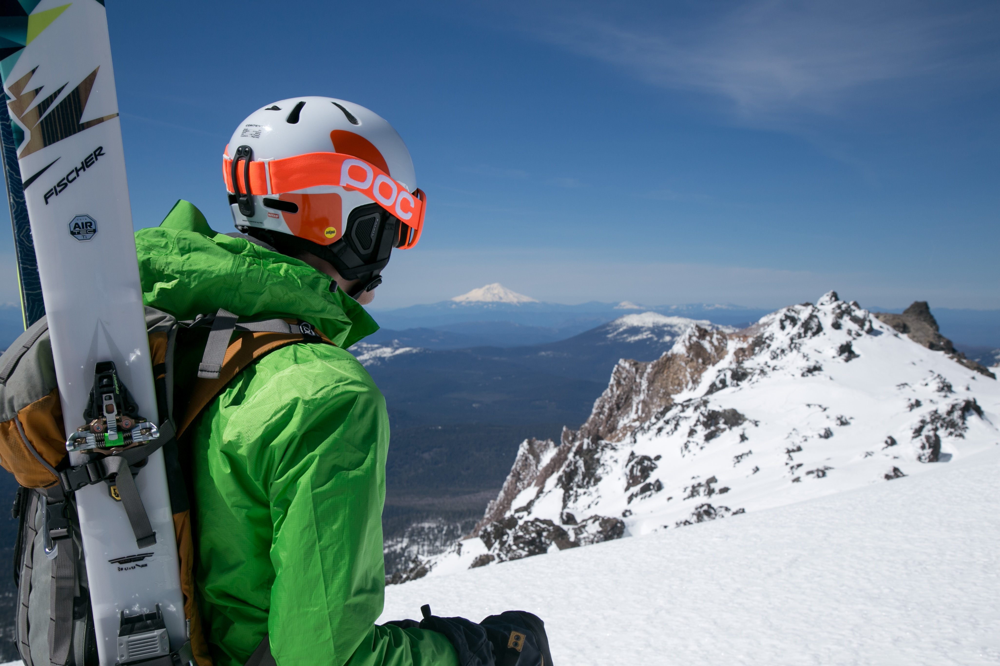
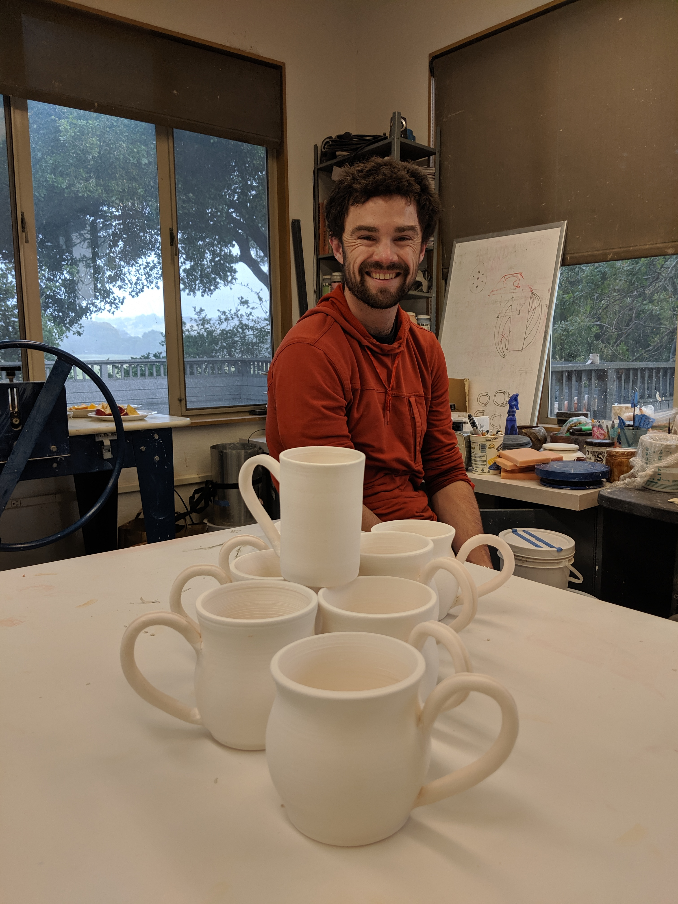

I enjoy expressing my creativity in hobbies that exist at the intersection of structured process and personal customization. I especially enjoy creating objects that I can use to fill the world around me from my morning mug of coffee, the backpack I bring to work, and the images I use as my screensaver on my computer. 

### Photography

  

    

    

    

  

I started taking photos when I got my first DSLR in my senior year of high school. My freshman year I took a digital photography class, deepening my understanding of the mechanics of digital, and inspiring me to take photography more seriously. I began taking mostly landscapes photos on family backpacking trips, then taking photos for the cycling team and track team I coached. My senior year of college I also took a fine arts photography course after which I began focusing more on portraits and photos of human subjects in the outdoors. I used to post most of my photos to my [flickr page](https://www.flickr.com/photos/paul_summers/), but in the last 5 years I have been the leaving the camera at home more, for better or worse. I've recently been missing photography, so maybe I'll have more updates here soon.

### Ceramics

  

    

    

    

  

I took my first ceramics sculpture course at the Palo Alto Junior Museum when I was maybe 8 years old, and I've had an on again, off again relationship with ceramics ever since. In undergrad I was lucky enough to get unlimited access to the ceramics studio, and I took advantage of that time making dozens of mugs and even a few tea pots! After graduating, I took a few other ceramics classes mostly to gain access to studios. I have mostly make mugs, I love giving them away, and you can never have enough bowls for your keys and loose change. I haven't thrown anything in a few years, but I hope that I will find a convenient studio again in the future, where ever that may be.

### Sewing

  

    

    

    

  

I made my first "tent" when I was in middle school borrowing my mom's sewing machine, and asking her to reset it every time I had a jam (which was often). This hobby was kicked into gear again when the pandemic shut the world down, and I ordered my Janome "Easy Sew 15" from Home Depot (an essential serve at the time, so still open) and started practicing with stuff sacks and zipper bags. Fast forward a years and I have made a tarp tent, duffel bags that survived Antarctica (twice so far), a few backpacks, and way too many stuff sacks.

 I started making bags and gear, but am now working my way into clothing and apparel. If you're on a similar path, I can't recommend using a good pattern enough. [The Green Pepper](https://www.thegreenpepper.com/) is a good site, and others with custom made patterns like [freesewing.org](https://freesewing.org/) and [pattern adventure](https://www.patternadventure.com/en) are exciting to me, but I'm yet to actually try them. I've also had some luck with [learnMYOG](https://learnmyog.com/) though I have found the apparel to fit my body poorly unfortunately. For gear patterns, my favorite pattern source so far is [Stitchbackgear](https://www.etsy.com/shop/Stitchbackgear), which has good patterns, great instructions, and lots of customization options included in the patterns. 

 I really enjoy making my own clothing and gear, I'm not sure if I'm saving money after all the equipment I've purchase (cutting mats, scissors, thread, snaps and buckles, etc), but every compliment and "You _made_ that?" brings me a little bit of joy. The downside now is that its my own fault when the water bottle pocket on my pack is just the wrong size, but there is always version 2.0 (or 3.0) to improve that!

