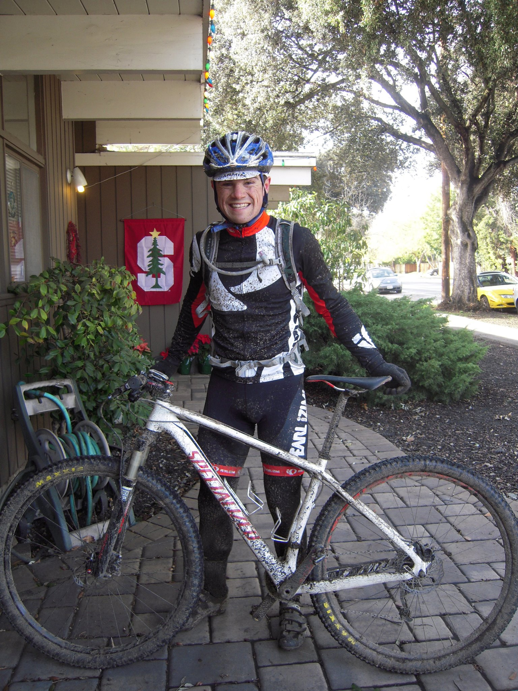

### High School Track and Cross Country Running

  

    

    

    

  

I started running in middle school when we had to run the mile every other week in PE. for some reason I decided it was more fun to run fast, and eventually I was convinced I should join the cross country team that fall. I ended up dropping baseball and soccer in high school and started running year round in Track (1 & 2 mile mostly) and Cross Country. I made the Varsity team all 4 years, and competed in State Cross Country and Track meets. I spent my fair of time on a track during this time, to the point I'm still a little shy of them today. 

Most importantly, I found a great community of friends on the track and cross country team. These friends helped shape who I became today, and I've stayed close with many of them to this day, even meeting up for weekday runs when we find the time. 

I was recruited for the Stanford Cross Country as a red shirt freshman, I never competed for the team officially though I did run some of the same races. The higher volume summer and fall training for competing at that level left me fairly burned out, and took the joy out of running for me, so I walked off the team after that season.

### College Cycling 

  

    

    

    

  

My sophomore year of undergrad, moving on from running I found the cycling club, which for me struck a better balance between competitiveness and fun than running. I got into road cycling, preferring road races over criteriums (I broke my collar bone in my first criterium, rough start) and cross country mountain biking. 

I again found a strong community on the cycling team, and have stayed close to many of these fiends, though we mostly ski together now. Turns out gravity sports are more fun when something carries you up the hill. Go figure. 

### Marathon+ Running

After cycling, I again returned to running, though this time mainly on trail, and mostly much much slower. This odd curiosity to see just how far I can run is shared with a few friends who have the patience to hear me tell the same story 5+ times (on the same run sometimes...). I tend to do only 1 or 2 'races' a year, and tackle other random goals. In 2022 I ran at least a marathon distance at least once every month (December was hardest), including the Grand Canyon, and a few long point to point sections of the bay area ridge trail. I'd like to run a marathon on every continent eventually, and am trying to decide if I want to try running 100 miles. 

You can see what I'm up to recently at [my Strava account](https://www.strava.com/athletes/43072) or on [ultra sign up](https://ultrasignup.com/results_participant.aspx?fname=Paul&lname=Summers). 