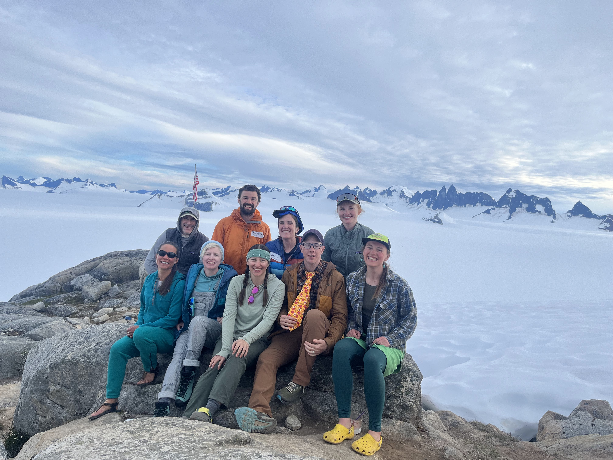
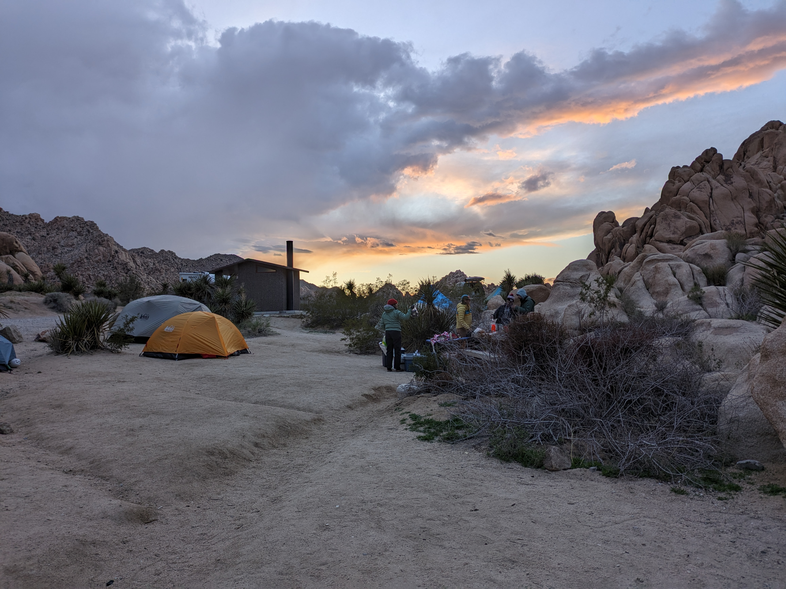
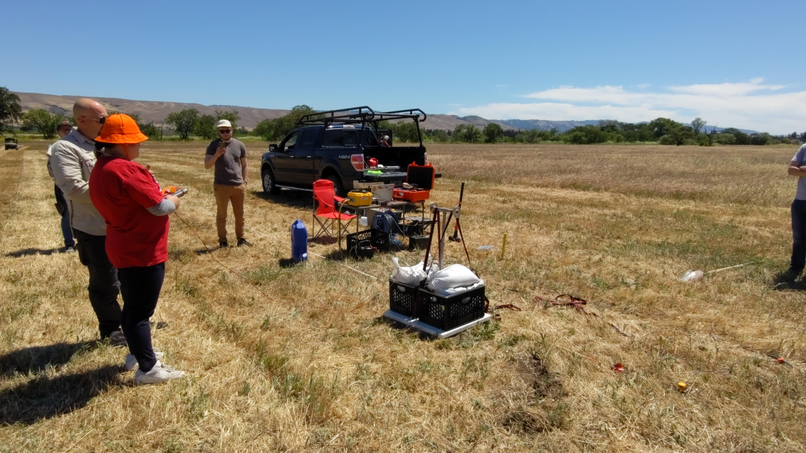

## Juneau Ice Field Research Program (JIRP) July 2024

  

    

    

    

  

### JIRP Block 2 Academic Faculty 
During July 2024, I was academic faculty for JIRP Block 2 where I worked with a team of  team of 8 other faculty to instruct 34 mostly undergraduate students. The curriculum focused on geosciences, mountaineering, and wilderness skills, and I focused on glacial deformation and ice flow. Instruction was in formal lectures, small workshops, and field based research experiences. 

## Joshua Tree National Park March 2024 

  

    

    

    

  

### Outdoor Educator Apprentice for Rock Climbing: Intermediate Anchors 
During Spring Break 2024, I was an Outdoor Educator Apprentice for a 7 day climbing class in Joshua Tree National Park. We taught a class a 8 students the basics of trad gear placement and anchor construction, as well as proper belaying and repelling for a variety of single pitch scenarios. This was a continuation of the work last year, and I took on a more advanced roll leading multiple sessions.

## Thwaites Glacier, Antarctica Nov 2023 - Feb 2024 

  

    

    

    

  

### Scientist on TIME Team Expedition
Worked as a part of a team of 15 on Thwaites Glacier for 30+ days to complete a seismic and radar survey of the Eastern Shear Margin. Additionally spent 7+ days at Eastwind Glacier near McMurdo Station doing additional radar surveys of both grounded and floating ice.

<ul class="actions">
  <li><a href="{{ 'TIME2023.html' | absolute_url }}" class="button">TIME 2023</a></li>
      </ul>

## Joshua Tree National Park March 2023 

  

    

    

    

  

### Outdoor Educator Apprentice for Rock Climbing: Intermediate Anchors 
During Spring Break 2023, I was an Outdoor Educator Apprentice for a 7 day climbing class in Joshua Tree National Park. We taught a class a 6 students the basics of trad gear placement and anchor construction, as well as proper belaying and repelling for a variety of single pitch scenarios. 

## Coyote Valley, California May 2022 

  

    

    

    

  

### Teaching Assistant for Near Surface Geophysics: Imaging Groundwater Systems 

In the Spring of 2022 I was co-TA with Javier Peralta for Professor Rosemary Knight's Geophysics 190 course. We worked with the Santa Clara Open Space Authority to image the ground water system at Coyote Valley Open Space, San Jose California using seismic, electric resistivity tomography (ERT), and towed transient electromagnetic (T-TEM) methods. This was a 'Cardinal Course' that involved 11 undergraduates doing hands on field research with all the above geophysical methods. 

## Thwaites Glacier, Antarctica Oct 2021 - Jan 2022 

  

    

    

    

  

### Scientist on TIME Team Expedition
I spent 2 weeks on Thwaites Glacier as a team of 6 recovering passive seismic and GPS equipment that had been deployed for 2 years. Additionally we did 2 days of bistatic radar surveying. This season was impacted by logistical constraints that shortened the season significantly. 

<ul class="actions">
	<li><a href="{{ 'TIME2021.html' | absolute_url }}" class="button">TIME 2021</a></li>
      </ul>

