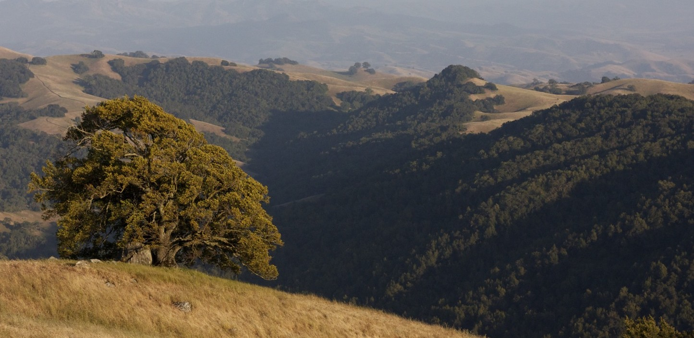
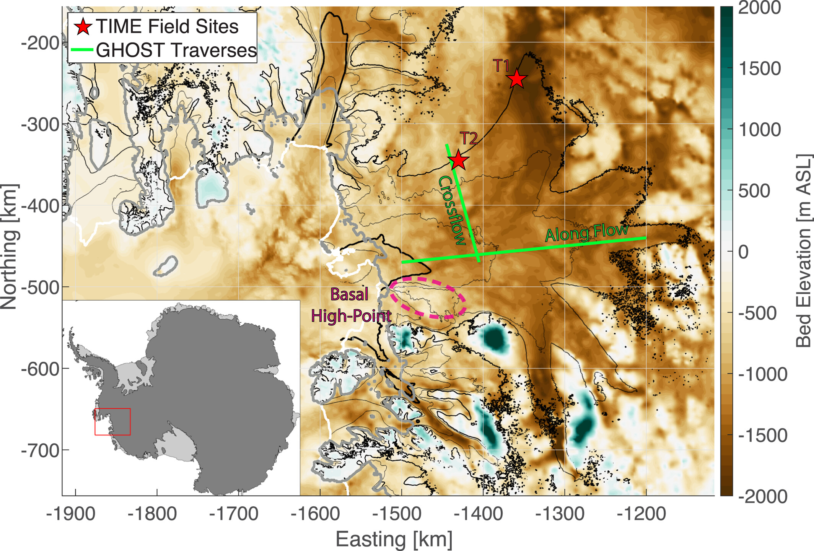
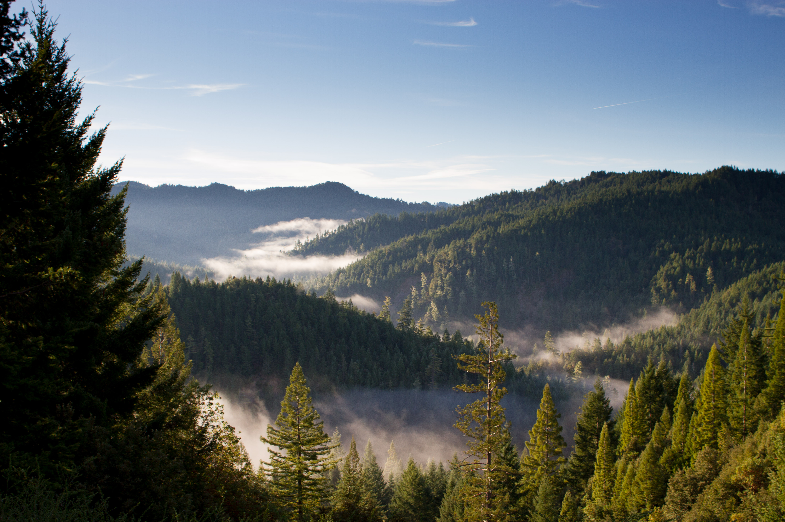
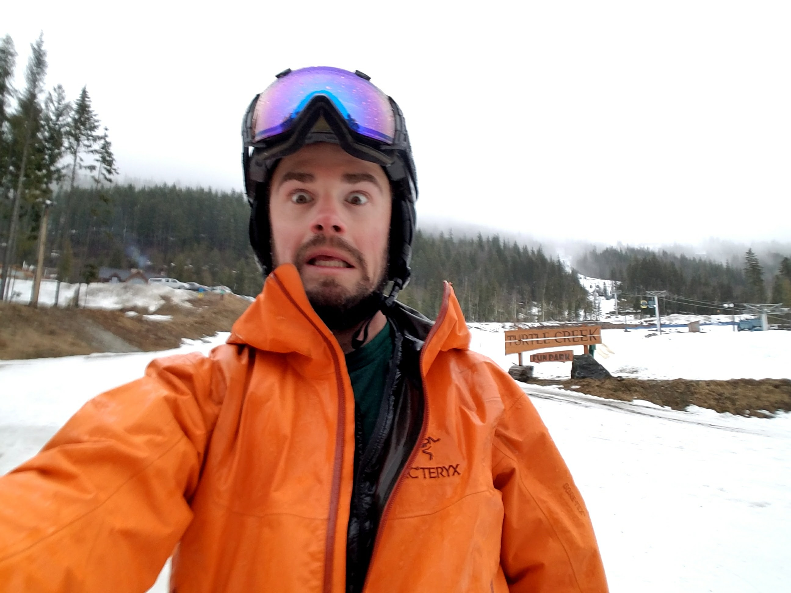

<!-- Section -->
<section>
  

    <article>
      
      <h3>About Me</h3>
      
Where I come from and what I'm moving towards 

      <ul class="actions">
	<li><a href="{{ 'about_me.html' | absolute_url }}" class="button">About Me</a></li>
      </ul>
    </article>
        <article>
      
      <h3>Teaching</h3>
      
My teaching experiences, both in traditional academic settings and outdoor education

      <ul class="actions">
	<li><a href="{{ 'teaching.html' | absolute_url }}" class="button">Teaching</a></li>
      </ul>
    </article>
    <article>
      
      <h3>Research</h3>
      
Research projects I'm currently working on, as well as some past projects

      <ul class="actions">
	<li><a href="{{ 'research.html' | absolute_url}}" class="button">Research</a></li>
      </ul>
    </article>
        <article>
      
      <h3>CV</h3>
      
This is a copy of my CV, updated periodically.  

      <ul class="actions">
	<li><a href="{{ 'cv.html' | absolute_url }}" class="button">My CV</a></li>
      </ul>
    </article>
    <article>
      
      <h3>Fieldwork</h3>
      
Even as a model based researcher, I've had the great pleasure to do some field based research

      <ul class="actions">
	<li><a href="{{ 'fieldwork.html' | absolute_url }}" class="button">Fieldwork</a></li>
      </ul>
    </article>
    <article>
      
      <h3>Personal Interests</h3>
      
What I like to do outside of work 

      <ul class="actions">
	<li><a href="{{ 'fun.html' | absolute_url }}" class="button">Personal Interests</a></li>
      </ul>
    </article>
  

</section>
