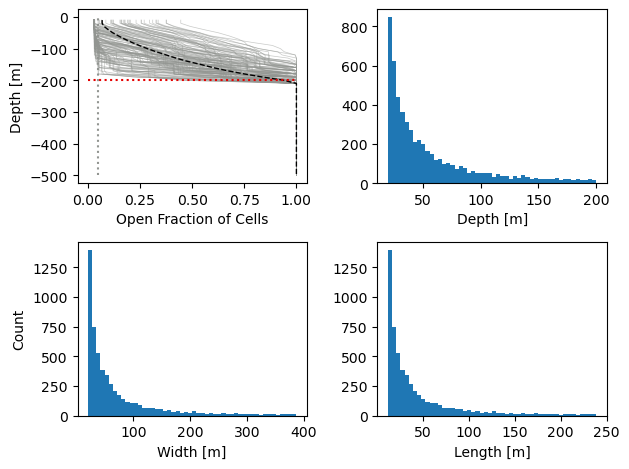
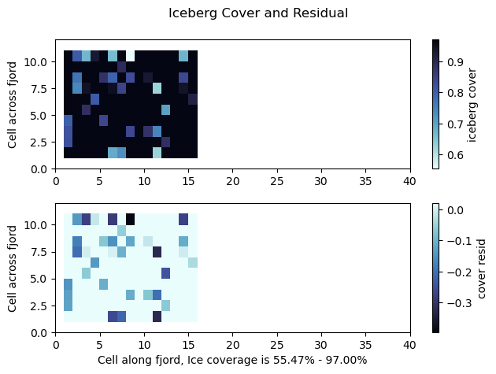
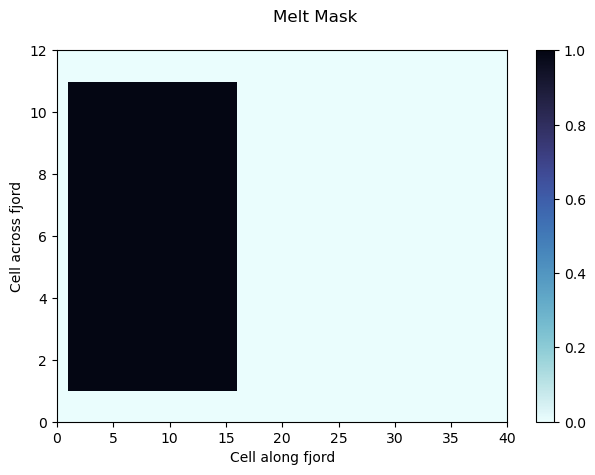

This script generates random icebergs accoring to a power distribution, following (Davison et al. 2020) (10.5194/tc-16-1181-2022) and creates all accessory files needed to run MITgcm with this distribution of icebergs and desired custom masks. Last update November 2024. Please reach out for more up to date versions.

### Loading libraries and establishing some helper functions


```python
import numpy as np
import matplotlib.pyplot as plt
import fileinput
import sys
import cmocean

writeFiles = False # make True if want to actually save files

def setUpPrint(fname):  #this functions lets you control how setup output is printed or saved. 
    print(fname)

def write_bin(fname, data):
    setUpPrint(fname + str(np.shape(data)))
    if(writeFiles):
        data.astype(">f8").tofile(fname)
    else:
        setUpPrint('\tNot saving')
```

### Make domain sizes, establish grid spacing 
This must agree with dimensions from SIZE.h and input/data file 


```python
setUpPrint('====== Making mélange =====')
#Make Masks

nz = 50
ny = 12
nx = 40

# All meters
deltaZ = 10
deltaY = 500
deltaX = 500
dz = np.ones(nz) * deltaZ

iceBergDepth = 200 #[m]
iceExtent = 8000 #[m]

iceCoverage = 95 # Coverage of ice [%]
```

    ====== Making mélange =====


### Make masks for customized behavior of icebergs
`bergMask = 1` in all locations within the grid where icebergs may exist.
`driftMask = 1` in all locations within the grid where iceberg melt velocities are calculated with respect to the average ocean current along the draft of the iceberg. This simulates drifting within the cell, but does not let the icebergs drift between cells. This should be `=0` if bergs are locked within a mélange pack.
`meltMask = 1` in all locations within the grid where iceberg melt is calculated. Without melt, bergs will only have a physical blocking interaction with the ocean, but no melt water or thermodynamic effect will be calculated.
`barrierMask = 1` in all locations within the grid where the physical blocking effect of the icebergs will interact with the ocean. 
`bergConc` is the percent surface area of ice at every gird cell with icebergs. To have 95% ice, input `95`, not `0.95`.
`bergMaskNums` is the assigned ID numbers of all grid cells with icebergs. This is assigned further below.
`numBergsPerCell` is the number of icebergs within every cell. This is populated further below.


```python
bergMask = np.zeros([ny,nx])
driftMask = np.zeros([ny,nx])
meltMask = np.zeros([ny,nx])
barrierMask = np.zeros([ny,nx])
bergConc = np.zeros([ny,nx])
bergMaskNums = np.zeros([ny,nx])
numBergsPerCell = np.zeros([ny,nx],dtype=np.int64)
```

### Set Parameters
Masks are populated here, and default iceberg parameters are input. These values can still adjustable as needed, but for simple cases can be left as default. At the end we output total area of grid to be filled with icebergs, total top surface area of icebergs, and the ratio as a sanity check. This should equal the `bergConc` if `bergConc` is uniform for iceberg cells. 


```python
# Berg parameters
bergType = 1 # 1 = block 2 = cone (not implemented)
alpha = 1.8 # slope of inverse power law size frequency distribution
scaling = 2 # 1 = Sulak 2017 2 = Barker 2004
maxBergDepth = iceBergDepth # (m) - set to zero if 'prescribing' max iceberg width, set at top here
minBergDepth= 20 # (m)
maxBergWidth = 0 # (m) - set to zero if 'prescribing' max iceberg depth
minBergWidth = 20 # (m)

if(scaling == 1): # then use Sulak17 volume-area scaling volume = 6.0*area^1.30
    # assumes volume = L*W*D and W = L/1.62 (Dowdeswell et al 1992)
    if(maxBergWidth==0):
        maxBergWidth = 0.0642449*maxBergDepth**(5/3)
        # minBergWidth = 0.0642449*minBergDepth**(5/3)
    elif(maxBergDepth==0):
        maxBergDepth = 5.19155*maxBergWidth**(5/3)
        minBergDepth = 5.19155*minBergWidth**(5/3)
elif(scaling == 2): # Then use Barker04 width-depth relationship
    # Depth = 2.91*Width^0.71
    if(maxBergWidth==0):
        maxBergWidth = (100*10**(58/71)*maxBergDepth**(100/71)) / (291*291**(29/71))
        #minBergWidth = (100*10**(58/71)*minBergDepth**(100/71)) / (291*291**(29/71))        
    elif(maxBergDepth==0):
        maxBergDepth = 2.91*maxBergWidth^0.71
        minBergDepth = 2.91*minBergWidth^0.71

#Extent of ice in grid cells
iceExtentIndex = int(np.round(iceExtent/deltaX))

# Iceberg mask
bergMask[1:-1,1:iceExtentIndex] = 1 # icebergs, all oriented east-west (other values can turn bergs, PS has not tested this functionality)

# Drift mask, No drift for Melange experiments, but can toggle on here if you want
# driftMask[1:-1,1:iceExtentIndex] = 1 # calculate effect of iceberg drift on melt rates 

# Melt mask, only let bergs melt in this region (make melt water, these don't change size)
meltMask[1:-1,1:iceExtentIndex] = 1 # Allow focus on blocking effect only

# Barrier mask
barrierMask[1:-1,1:iceExtentIndex] = 1 # make icebergs a physical barrier to water flow

# Iceberg concentration (# of each surface cell that is filled in plan view)
bergConc[1:-1,1:iceExtentIndex] = iceCoverage # iceberg concentration set at top

desiredBergArea = np.sum(bergConc/100.0*deltaX*deltaY)
bergMaskArea = np.sum(bergMask*deltaX*deltaY)
setUpPrint('Area where bergs live: ' + str(bergMaskArea) + ' m^2')
setUpPrint('Desired berg area: ' + str(desiredBergArea) + ' m^2')
setUpPrint('Ratio: ' + str(desiredBergArea/bergMaskArea*100) + '%') #This should equal the bergConc if uniform for iceberg cells.
```

    Area where bergs live: 37500000.0 m^2
    Desired berg area: 35625000.0 m^2
    Ratio: 95.0%


### Generating Icebergs
Now the fun. This section generates icebergs from a power distribution and compares the total top surface area of the bergs to the desired area of bergs. This is a random process, so it may bounce around a few times before reaching the match criteria. Bergs are clipped horizontally so they fit into one cell for simplicity, this is a deviation from the method of Davison et al who split large bergs into multiple cells. Progress is printed, and exit condition printed.


```python
numberOfBergs = 1000 #low start, immediately doubled by scheme below, so guess low, high guesses (300%+) can cause to fail
bergTopArea = 0
areaResidual = 1
# Generate the Inverse Power Law cumulative distribution function
# over the range minBergWidth-maxBergWidth with a slope of alpha.
setUpPrint('Making bergs, this can take a few loops...')
loop_count = 1
while(np.abs(areaResidual) > .03 ): # Ensure correct surface area, I set to .01 for more exact coverage, but longer generation time 
    numberOfBergs = round(numberOfBergs * (1 + areaResidual))
    setUpPrint('\tnumberOfBergs: ' + str(numberOfBergs))
    x_width = np.arange(minBergWidth, maxBergWidth, (maxBergWidth-minBergWidth)/(numberOfBergs*1e2))
    x_depth = np.arange(minBergDepth, maxBergDepth, (maxBergDepth-minBergDepth)/(numberOfBergs*1e2))
    inversePowerLawPDF_width = ((alpha-1) / minBergWidth) * (x_width/minBergWidth) ** (-alpha)
    inversePowerLawPDF_depth = ((alpha-1) / minBergDepth) * (x_depth/minBergDepth) ** (-alpha)
        # Get the CDF numerically
    inversePowerLawCDF_width = np.cumsum(inversePowerLawPDF_width)
    inversePowerLawCDF_depth = np.cumsum(inversePowerLawPDF_depth)
        # Normalize
    inversePowerLawCDF_width = inversePowerLawCDF_width / inversePowerLawCDF_width[-1]
    inversePowerLawCDF_depth = inversePowerLawCDF_depth / inversePowerLawCDF_depth[-1]
        
        # Generate number_of_bergs uniformly distributed random numbers.
    uniformlyDistributedRandomNumbers = np.random.uniform(0,1,numberOfBergs)
    
    inversePowerLawDistNumbers_width = np.zeros(uniformlyDistributedRandomNumbers.size);
    inversePowerLawDistNumbers_depth = np.zeros(uniformlyDistributedRandomNumbers.size);
    nearestIndex_width = [0] * uniformlyDistributedRandomNumbers.size
    nearestIndex_depth = [0] * uniformlyDistributedRandomNumbers.size
    
    for i in range(uniformlyDistributedRandomNumbers.size):  #this is pretty slow, not sure if vectorized exists
        nearestIndex_width[i] = np.abs(uniformlyDistributedRandomNumbers[i]-inversePowerLawCDF_width).argmin();
        nearestIndex_depth[i] = np.abs(uniformlyDistributedRandomNumbers[i]-inversePowerLawCDF_depth).argmin();
    
    inversePowerLawDistNumbers_width = x_width[nearestIndex_width];
    inversePowerLawDistNumbers_length = inversePowerLawDistNumbers_width/1.62 # Widths are bigger 
    tooWide = np.count_nonzero(inversePowerLawDistNumbers_width > deltaX)
    tooLong = np.count_nonzero(inversePowerLawDistNumbers_width > deltaX)
    inversePowerLawDistNumbers_width[inversePowerLawDistNumbers_width > deltaX] = deltaX # Max width is grid cell (assumed square)
    inversePowerLawDistNumbers_length[inversePowerLawDistNumbers_length > deltaX] = deltaX # Max length is grid cell (assumed square)
    if(tooLong + tooWide > 0):
        setUpPrint('\t\tBergs clipped: %i for width, %i for length' % (tooWide, tooLong))
    
    inversePowerLawDistNumbers_depth = x_depth[nearestIndex_depth]; #depths don't get clipped
    
    bergTopArea = sum(inversePowerLawDistNumbers_width*inversePowerLawDistNumbers_length)
    areaResidual = (desiredBergArea - bergTopArea)/desiredBergArea
    setUpPrint('\t\t%.2f %% Bergs' % (bergTopArea/bergMaskArea*100))
    setUpPrint('\t\tareaResidual %.2f %%' % (areaResidual * 100))
    loop_count += 1
setUpPrint('====== Success! Found our bergs =====')
setUpPrint('Width min/mean/max: %f/%f/%f [m]' % (np.min(inversePowerLawDistNumbers_width),np.mean(inversePowerLawDistNumbers_width),np.max(inversePowerLawDistNumbers_width)))
setUpPrint('Depth min/mean/max: %f/%f/%f [m]' % (np.min(inversePowerLawDistNumbers_depth),np.max(inversePowerLawDistNumbers_depth),np.max(inversePowerLawDistNumbers_depth)))
setUpPrint('Total Berg Area %f' % bergTopArea)
setUpPrint('Total Berg fract: %.2f %%' % (bergTopArea/bergMaskArea*100))
```

    Making bergs, this can take a few loops...
    	numberOfBergs: 2000
    		32.73 % Bergs
    		areaResidual 65.54 %
    	numberOfBergs: 3311
    		55.61 % Bergs
    		areaResidual 41.46 %
    	numberOfBergs: 4684
    		77.72 % Bergs
    		areaResidual 18.19 %
    	numberOfBergs: 5536
    		93.18 % Bergs
    		areaResidual 1.91 %
    ====== Success! Found our bergs =====
    Width min/mean/max: 20.001988/72.124486/386.819828 [m]
    Depth min/mean/max: 20.001951/199.997724/199.997724 [m]
    Total Berg Area 34944156.928792
    Total Berg fract: 93.18 %


### Placing Icebergs
After icebergs are generated, they are sorted large to small, then placed into random cells 1 at a time. Large bergs are placed first to ensure no berg is left unplaced. When cells are too full for the currently being placed cell, another random cell is picked until the berg fits. Further can bergs can still be placed into that cell until it reaches the full criteria (2% more than `bergConc`). This method tends to generate many cells at the full criteria. Loosening the full critera (higher pad) could allow a more uniform distribution of ice berg concentration across all cells, but here this is optimized for high iceberg concentration (~95%) and so a cap below 100% was selected.


```python
# Now we sort these berg into cell, randomly 

bergMaski = 0  #Bad name, but this is the count of cells that will recieve bergs
bergDict = {}

for j in range(ny):
    for i in range(nx):
        if(bergMask[j,i] == 1):
            # print('i,j, bergmask',i,j,bergMask[j,i])
            bergMaski = 1 + bergMaski #Needs to start at 1, as non-bergs will be 0
            bergMaskNums[j,i] = bergMaski #Assign Mask Nums, not random as we'll randomly place bergs in cells
            bergDict[bergMaski] = [j,i] #This lets us do 1-D loops for the whole grid

setUpPrint('%i cells with bergs' % bergMaski)
# print(bergDict)

# Sort my bergs
sorted_indices = np.argsort(-inversePowerLawDistNumbers_depth) # Sort backwards to get descending from big to small bergs 
sorted_depth = inversePowerLawDistNumbers_depth[sorted_indices]
sorted_width = inversePowerLawDistNumbers_width[sorted_indices]
sorted_length = inversePowerLawDistNumbers_length[sorted_indices]
assignedCell = np.random.randint(0,bergMaski,[numberOfBergs]) # In this script, every berg has a home

# Need to reshuffle as it re-writes this when sorting
# Array for bergs
bergsPerCellLimit = 500
icebergs_depths = np.zeros([bergMaski,bergsPerCellLimit])
icebergs_widths = np.zeros([bergMaski,bergsPerCellLimit])
icebergs_length = np.zeros([bergMaski,bergsPerCellLimit])  #careful, not plural as to length match

assignedCell = np.random.randint(0,bergMaski,[numberOfBergs]) #every Berg has a spot

icebergs_per_cell = np.zeros([bergMaski],dtype=np.int16)
icebergs_area_per_cell = np.zeros([bergMaski])

for i in range(numberOfBergs): 
    j = assignedCell[i]
    # print('looking at mask number',j,'at berg',i)
    # print('Berg number', icebergs_per_cell[j],'in this cell')
    bergArea = sorted_width[i] * sorted_length[i]
    loopLimiter = 0
    while(bergArea > (deltaX * deltaY  * (bergConc[bergDict[j+1][0],bergDict[j+1][1]]/100 + .02) - icebergs_area_per_cell[j])): #if too full, pick random new cell
        j_old = j
        j = np.random.randint(0,bergMaski)
        assignedCell[i] = j
        loopLimiter += 1
        # print(j_old, "is full, trying",j, "attempt", loopLimiter)
        if(loopLimiter > bergMaski):
            setUpPrint('no more empty cells... giving up')
            break
    icebergs_depths[j,icebergs_per_cell[j]] = sorted_depth[i]
    icebergs_widths[j,icebergs_per_cell[j]] = sorted_width[i]
    icebergs_length[j,icebergs_per_cell[j]] = sorted_length[i]
    icebergs_per_cell[j] += 1
    # icebergs_area_per_cell[j] = np.sum(icebergs_widths[j,:]*icebergs_length[j,:])
    icebergs_area_per_cell[j] += bergArea
# setUpPrint('Bergs per cell and filled faction at surface for spot check')     
# setUpPrint(icebergs_per_cell)
# setUpPrint(np.round(icebergs_area_per_cell/(500*500),2))

# All bergs now sorted 
openFrac = np.zeros([nz,ny,nx])
SA = np.zeros([nz,ny,nx])
SA[:,:,:] = np.nan
cellVolume = deltaX*deltaY*deltaZ

#This loop knows which cells should contain bergs are already, so we don't search for bergs across entire model domain
for i in range(bergMaski):
    bergCount = icebergs_per_cell[i]
    numBergsPerCell[bergDict[i+1][0],bergDict[i+1][1]] = bergCount
    if(bergCount > 1):
        lengths = icebergs_length[i,icebergs_length[i,:] > 0] #return only non-zeros
        widths = icebergs_widths[i,icebergs_widths[i,:] > 0] #return only non-zeros
        depths = icebergs_depths[i,icebergs_depths[i,:] > 0] #return only non-zeros
        for k in range(nz):
            d_bot = k*deltaZ + deltaZ #bottom of depth bin
            d_top = k*deltaZ
            volume1 = deltaZ * lengths[depths > d_bot] * widths[depths > d_bot]
            SA1 = deltaZ*2*(lengths[depths > d_bot] + widths[depths > d_bot])
            partialFill = (depths < d_bot) & (depths > d_top)
            #partial fill
            volume2 = (depths[partialFill] - d_top) * lengths[partialFill] * widths[partialFill]
            #partial sides
            SA2 = (depths[partialFill] - d_top)*2*(lengths[partialFill] + widths[partialFill]) 
            #bottom
            SA3 = lengths[partialFill] * widths[partialFill]
            #print(np.sum(volume1), np.sum(volume2))
            openFrac[k,bergDict[i+1][0],bergDict[i+1][1]] = 1-((np.sum(volume1) + np.sum(volume2))/cellVolume)
            SA[k,bergDict[i+1][0],bergDict[i+1][1]] = np.sum(SA1) + np.sum(SA2) + np.sum(SA3)
    elif(bergCount == 0):
        openFrac[:,bergDict[i+1][0],bergDict[i+1][1]] = 1
        SA[:,bergDict[i+1][0],bergDict[i+1][1]] = 0


```

    150 cells with bergs


### Plotting
Output nice visuals of iceberg placement, depth distribution, and packing. These are also saved for later reference. 


```python


# Plots for reference on whats happening berg-wise
fig = plt.figure()
plt.subplot(2,2,1)
for i in range(bergMaski):
    plt.plot(openFrac[:,bergDict[i+1][0],bergDict[i+1][1]],-np.cumsum(dz),alpha=.5,color='xkcd:gray',linewidth=.5)
plt.plot(np.mean(openFrac[:,bergMask==1],1),-np.cumsum(dz),alpha=1,color='xkcd:black',linewidth=1,linestyle='--',label='Average Bergs')
plt.plot([0,1],[-maxBergDepth,-maxBergDepth],color = 'xkcd:red',linestyle=':', label='Target Max Depth')
plt.plot([1-np.max(bergConc)/100,1-np.max(bergConc)/100],[-nz*deltaZ,0],color = 'xkcd:gray',linestyle=':',label='Target Max Berg Conc')
plt.xlabel('Open Fraction of Cells')
plt.ylabel('Depth [m]')
# plt.legend()  #not quite room so off for now

plt.subplot(2,2,2)
plt.hist(inversePowerLawDistNumbers_depth,bins = 50)
# plt.ylabel('Count')
plt.xlabel('Depth [m]')

plt.subplot(2,2,3)
plt.hist(inversePowerLawDistNumbers_width,bins = 50)
plt.ylabel('Count')
plt.xlabel('Width [m]')

plt.subplot(2,2,4)
plt.hist(inversePowerLawDistNumbers_length,bins = 50)
# plt.ylabel('Count')
plt.xlabel('Length [m]')
fig.tight_layout()
plt.savefig('bergStatistics.png', format='png', dpi=200)
plt.show()

fig = plt.figure()
pltHelper = 1-openFrac[0,:,:]
pltHelper[bergMask == 0] = np.nan
plt.subplot(211)
pc = plt.pcolor(pltHelper,cmap='cmo.ice_r')
cbar = plt.colorbar(pc)
plt.suptitle('Iceberg Cover and Residual')
plt.ylabel('Cell across fjord')
cbar.set_label('iceberg cover')

plt.subplot(212)
pc = plt.pcolor(pltHelper - bergConc/100,cmap='cmo.ice')
cbar = plt.colorbar(pc)
pc_min = np.nanmin(pltHelper) * 100
pc_max = np.nanmax(pltHelper) * 100
plt.xlabel("Cell along fjord, Ice coverage is %.2f%% - %.2f%%" % (pc_min, pc_max))
plt.ylabel('Cell across fjord')
cbar.set_label('cover resid')
fig.tight_layout()
plt.savefig('bergMap.png', format='png', dpi=200)
plt.show()

fig = plt.figure()
pc = plt.pcolor(meltMask,cmap='cmo.ice_r')
cbar = plt.colorbar(pc)
plt.suptitle('Melt Mask')
plt.ylabel('Cell across fjord')
plt.xlabel("Cell along fjord")
fig.tight_layout()
plt.savefig('meltMask.png', format='png', dpi=200)
plt.show()


```


    

    


    /var/folders/56/63bb976d7mz5gryxtqfvqmgc0000gr/T/ipykernel_16172/217056070.py:36: MatplotlibDeprecationWarning: Getting the array from a PolyQuadMesh will return the full array in the future (uncompressed). To get this behavior now set the PolyQuadMesh with a 2D array .set_array(data2d).
      cbar = plt.colorbar(pc)
    /var/folders/56/63bb976d7mz5gryxtqfvqmgc0000gr/T/ipykernel_16172/217056070.py:43: MatplotlibDeprecationWarning: Getting the array from a PolyQuadMesh will return the full array in the future (uncompressed). To get this behavior now set the PolyQuadMesh with a 2D array .set_array(data2d).
      cbar = plt.colorbar(pc)


    

    


    

    


### Save output files
Now we save the files in various outputs. The `iceberg_*.txt` files are for compatability with the Davison et al (2020) verison of ICEBERG, and the `icebergs_*.bin` files are compatable with the new version of ICEBERG by Summers et al (2024) for this work. The presence of both file types doesn't interfere with the function of either version of ICEBERG. The other `.bin` files are needed by both versions of ICEBERG. A final print message is printed at the very end. 


```python
# write iceberg txt files
setUpPrint('Saving text files for bergs...')
if(writeFiles):
    for i in range(bergMaski):
        with open('iceberg_depth_%05i.txt' % (i+1) , 'w') as file_handler:
            for item in icebergs_depths[i,icebergs_depths[i,:] > 0]:
                file_handler.write("{}\n".format(item))
        with open('iceberg_width_%05i.txt' % (i+1) , 'w') as file_handler:
            for item in icebergs_widths[i,icebergs_widths[i,:] > 0]:
                file_handler.write("{}\n".format(item))
        with open('iceberg_length_%05i.txt' % (i+1) , 'w') as file_handler:
            for item in icebergs_length[i,icebergs_length[i,:] > 0]:
                file_handler.write("{}\n".format(item))

icebergs_depths2D = np.zeros([bergsPerCellLimit,ny,nx])
icebergs_widths2D = np.zeros([bergsPerCellLimit,ny,nx])
icebergs_length2D = np.zeros([bergsPerCellLimit,ny,nx])

for k in range(bergMaski):
    j = bergDict[k+1][0]
    i = bergDict[k+1][1]
    icebergs_depths2D[:,j,i] = icebergs_depths[k,:]
    icebergs_widths2D[:,j,i] = icebergs_widths[k,:]
    icebergs_length2D[:,j,i] = icebergs_length[k,:]

# write global files
write_bin('bergMask.bin',bergMask)
write_bin('bergMaskNums.bin',bergMaskNums)
write_bin('numBergsPerCell.bin',numBergsPerCell)
write_bin('openFrac.bin',openFrac)
write_bin('totalBergArea.bin',SA)
write_bin('meltMask.bin',meltMask)
write_bin('driftMask.bin',driftMask)
write_bin('barrierMask.bin',barrierMask)
write_bin('icebergs_depths.bin',icebergs_depths2D)
write_bin('icebergs_widths.bin',icebergs_widths2D)
write_bin('icebergs_length.bin',icebergs_length2D)

setUpPrint('Berg setup is done.')
```

    Saving text files for bergs...
    bergMask.bin(12, 40)
    	Not saving
    bergMaskNums.bin(12, 40)
    	Not saving
    numBergsPerCell.bin(12, 40)
    	Not saving
    openFrac.bin(50, 12, 40)
    	Not saving
    totalBergArea.bin(50, 12, 40)
    	Not saving
    meltMask.bin(12, 40)
    	Not saving
    driftMask.bin(12, 40)
    	Not saving
    barrierMask.bin(12, 40)
    	Not saving
    icebergs_depths.bin(500, 12, 40)
    	Not saving
    icebergs_widths.bin(500, 12, 40)
    	Not saving
    icebergs_length.bin(500, 12, 40)
    	Not saving
    Berg setup is done.

