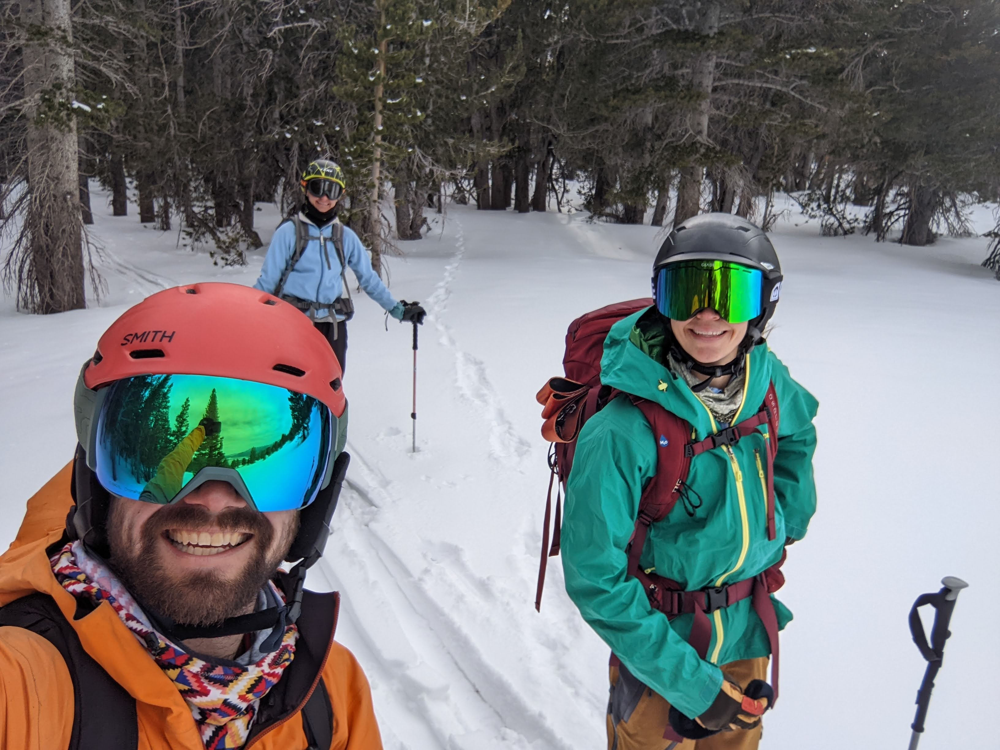
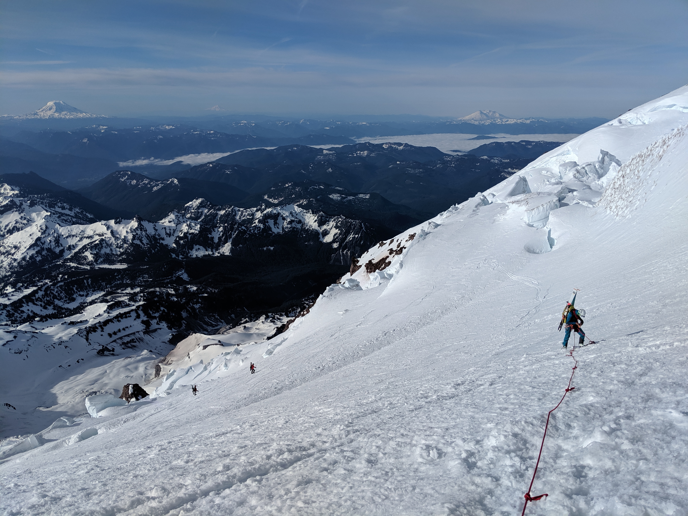
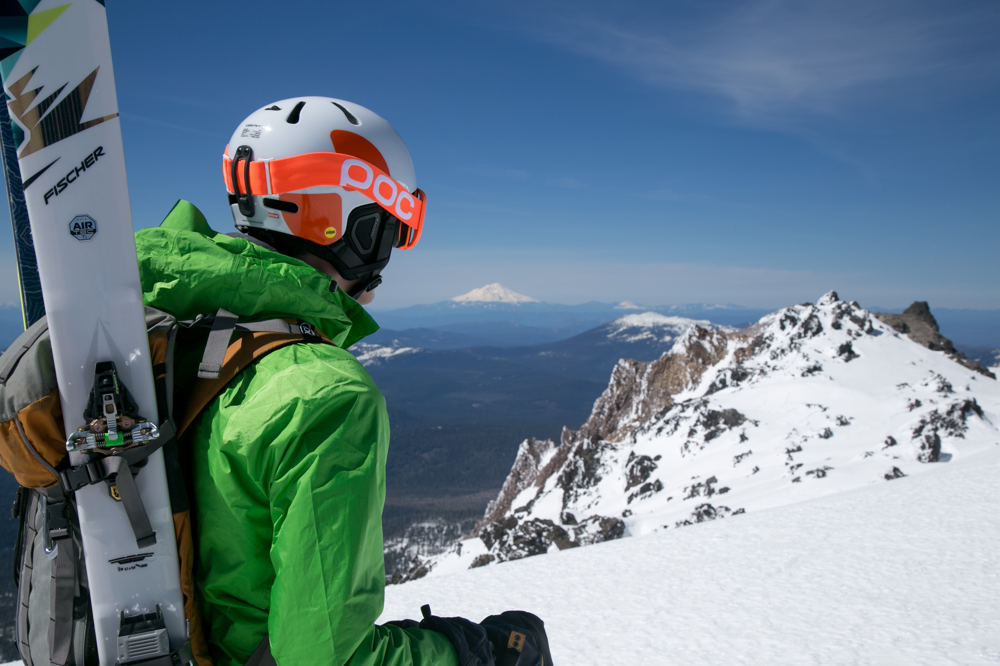

### Scouting 
I was exposed to outdoor activities from a young age with my family, but really began to get involved in outdoor recreation with scouting. I joined Troop 14, based in Palo Alto, drawn in by their frequent backpacking trips and came to see our two weeks at Camp Oljato, a BSA run camp in the Sierra, as a highlight of every summer. It was though scouting trips like this that I developed hobbies I continue today like backpacking, winter camping, skiing, rock climbing, and others I'd love to pick up again like archery, sailing, and even table tennis. 

### Backpacking
I was lucky enough to peak early in life with my backpacking trips, completing the John Muir Trail in 2008 with two other friends. This first long trip without parental supervision or planning was empowering and eye opening to the type of trips I could go on if I continued to develop my outdoor skills. Sadly I'm yet to repeat another backpacking trip longer than a week, but I try to get out for a few weekend trips a year and aspirationally try to fit in a week long trip most summers, though it doesn't always happen. 

### Climbing
Despite being dropped by my belayer on my first day of outdoor climbing at scout camp (he caught me just before the ground) I had a great time, and my safety record has only been improving since then. I enjoy climbing in all varieties outside, but dream mostly of longer alpine trad routes. I'm spoiled to have mostly climbed in Yosemite but am trying to expand my horizons to other Sierra destinations, or ever farther afield. If you have a favorite route, I'd love to hear about it!

### Skiing 

  

    

    

    

  

I grew up skiing alpine in middle school with scouts and my family, then mostly cross country with my girlfriend and her family in high school. After graduation from undergrad I made the jump to alpine touring after graduation from undergrad, and have been excited about touring since then. Avoiding the crowds and getting a nice workout in is a win-win! I mostly have skied the most common lines in Tahoe and East Sierra areas, but have also done some ski mountaineering on Mt Shasta and Mt Rainier. 