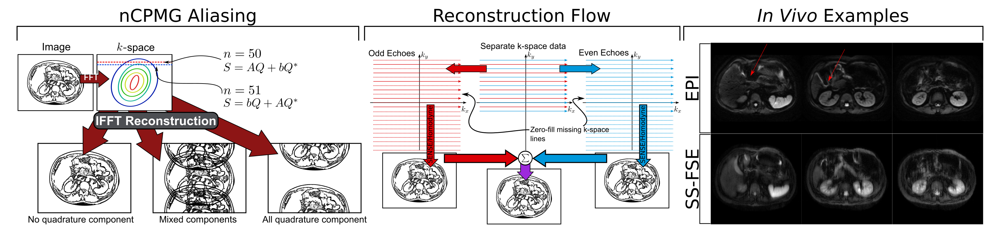
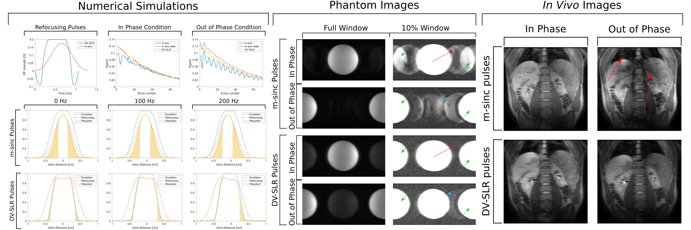
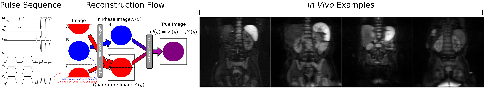
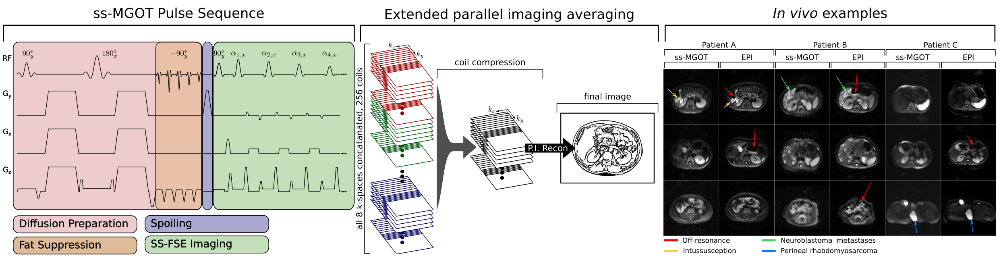

I am an imaging scientist.  My interest in medical imaging came as a result of waterski accident which led to a traumatic brain injury which in turn led to many CT scans when I was in high school.  As an undergraduate, I found a perfect intersection between improving human health care and the elegance of the mathematics and physics that form the framework of magnetic resonance imaging (MRI).  I have been fortunate to work on technical problems in the medical field in both my graduate work and my post-doc and hope to continue working in this domain throughout my career.

<a href="{{ 'publications.html' | absolute_url }}" class="button">List of publications</a>

## Post-Doc

My work as a post-doc has focused on applying deep learning techniques towards various problems in MRI.  These applications have primarily been in the cardiac and neurological imaging spheres.  The applications have been wide-ranging, spanning from interpolation, super-resolution, and quantitative parameter map generation.

### Cardiac MRI Temporal Interpolation

Simultaneous multi-slice (SMS) imaging acquires multiple slices in the same duration as single slices.  This technique has been expanded to radial imaging for the application of cardiac perfusion MRI.  SMS provides increased slice coverage without a loss of temporal resolution.  However, radial SMS is currently limited to acquiring three slices at the same timee.  To expand coverage, a subsequent acquisition covering the additional area is required.    This is problematic as the cardiac phases for each slice are no longer are the same.  I proposed increasing the number of acquired slices by staggering the SMS slice locations at each heartbeat and using acquired slices at the same location from the previous and subsequent beats to temporally interpolate the missing slices.   In the medical imaging context, increasing the temporal resolution is analogous to video frame rate interpolation.  One promising technique, originally proposed for video frame interpolation, is the adaptive separable convolution method which uses a deep neural network to determine convolution kernels for each pixel of two adjacent time frames.  The convolution problem is simplified by casting a traditional 2-dimensional convolution as separable convolution with a vertical and horizontal kernel for reducing computation.  I modified and fine-tuned this network architecture to cardiac SMS imaging in  order to increase scan coverage from three slices to six without increasing the number of acquisitions.  We found that these interpolated images compared favorably quantitatively and visually to the ground truth reference images, showing quantitative superiority over standard interpolation methods. This method was presented as an oral presentation at the ISMRM Workshop on Machine Learning.  This work is being adapted for publication shortly.

### Quantitative Neuro-Imaging

Traditional diffusion spectrum imaging (DSI) capable of producing accurate neurite orientation dispersion and density imaging (NODDI) and generalized fractional anisotropy (GFA) parameter maps require hundreds of q-space samples which renders the scan time clinically untenable.  A convolutional neural network (CNN) was trained to generated NODDI and GFA parameter maps simultaneously from $10\times$ undersampled q-space data.  Forty-eight stroke and normal patient scans were acquired for the purposes of training, validating, and testing this method.  The proposed network was demonstrated to achieve significant performance advantages compared to previously proposed approaches, showing significant improvements across image quality metrics.  Additionally, generating different types of parameter maps using reasonably sampled q-space gives comes with the computational benefits of only needing to generate and train a single network instead of multiple networks for each parameter type.  Post-stroke outcome prediction metrics were found to not appreciably change when using images generated from this proposed technique. The proposed CNN was shown to be capable of providing quality DSI parameter maps while also reducing the scan time to 10 times the previous clinical standard.  This work is currently in submission for publication in *Magnetic Resonance in Medicine*.  

## Graduate School  
My thesis work has broadly aimed to reducing distortion in MR diffusion weighted images in the abdomen.  To achieve this aim, I have developed a robust diffusion weighted single-shot fast spin echo (SS-FSE) pulse sequence.  This sequence has seen three phases of development throughout my PhD.  (1) Initial implementation and introduction of accelerated image acquisition.  (2) Rigorous analysis of the effects of radiofrequency (RF) pulses on signal stability.  (3)  Improved reconstruction and sampling with additional work on analyzing the impact of organ motion.

### Initial Work and Accelerated Acquisition
Various methods have been proposed to overcome distortion in areas of off-resonance.  The most robust "fast" (i.e., the entire image signal is acquired rapidly in one signal excitation) imaging method is the SS-FSE sequence.  SS-FSE allows the signal to be refocused using RF pulses repeatedly which leads to less distortion.  However, the SS-FSE sequence requires strict rules known as the CPMG condition on the refocusing RF pulses, which diffusion contrast inherently violates.  A proposed method that allows using the SS-FSE sequence without the CPMG condition uses a quadratic phase sweep on the phases of the refocusing RF pulses while maintaining full signal.  This technique, however, introduces aliasing into the quadrature component of the final image, which is rendered as a half field-of-view shift.  This aliasing is resolved by transforming this into a parallel imaging problem.  This step is able to resolve imaging with minimal image blurring while maintaining adequate SNR compared to similar methods such as EPI. This work was validated extensively in phantom objects, ex vivo, as well as *in vivo* clinical examples.  This has been published in [*IEEE Transactions on Medical Imaging*](http://ieeexplore.ieee.org/document/7723819/).

   	     

### Signal Stability and RF Pulse Considerations
The nCPMG phase cycling technique also comes with the requirement to maintain both a consistent and sufficiently high refocusing RF pulses flip angle across the excited imaging slice.  Simulation suggests that flip angle must exceed 120$^\circ$ to maintain a stable signal.  These requirements, however, are problematic because to have the RF pulses satisfy achieve this level of selectivity, the RF pulse must be sufficiently long in duration.  Consequently, this increased duration leads to image blur and loss of SNR.  We have improved the SS-FSE sequence by replacing the RF pulses with lower selectivity with RF pulses that are highly selective and short duration.  To achieve these two aims, this class of RF pulses specially shaped to include a variable rate of excitation (VERSE).  In this work we optimized the RF pulses for this application, did rigorous simulation to validate our hypothesis, and validated our simulations in both in phantom and in vivo experiments.  This has been published in [*Magnetic Resonance in Medicine*](http://onlinelibrary.wiley.com/doi/10.1002/mrm.26694/abstract).

### Improved Reconstruction and Motion Analysis
While our previous work to resolve the aliasing was robust, it relied on an external calibration scan that is cumbersome for routine clinical imaging.  Recent work has improved the acquisition and reconstruction to not require such calibration as well decrease the needed total acquisition time.  This reduction in acquisition time per image further reduces image blurring and reduces the total scan time by reducing the specific absorption rate (SAR) accumulation throughout the imaging sequence.  Care has been taken to match the reconstruction routine to agree with the physics of the nCPMG theory rather than relying on heuristics. Additional work has been made to decrease in the impacts of motion on image quality to optimizing the diffusion weighting gradients to match the motion seen in the abdomen.  This has been published in [*IEEE Transactions on Medical Imaging*](https://www.ncbi.nlm.nih.gov/pubmed/28829307).

### Magnetization-Prepared Body DWI

This work included a new single-shot slice selective SS-FSE sequence that uses a magnetization preparation module to achieve both diffusion weighting and fat suppression.  While the SNR of this method is inherently low, much of this SNR can be regained through scan averaging.  We proposed a new averaging reconstruction approach for this work.  We validated this pulse sequence and reconstruction in simulation, in phantom experiments, and clinical *in vivo* scans.  This has been published in [*Magnetic Resonance in Medicine*](https://www.ncbi.nlm.nih.gov/pubmed/29044721).

