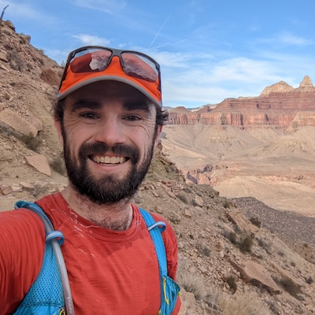
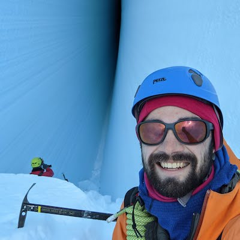
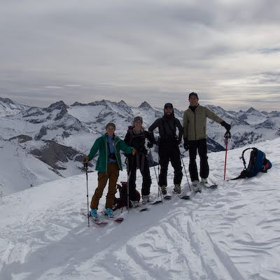

<section>
  

    <article>
      
      <h3>Grand Canyon 2022</h3>
      
Rim to Rim to Rim Run

    </article>
    <article>
      
      <h3>IMAX Crevasse 2021</h3>
      
Crevasse Spelunking

    </article>
    <article>
      
      <h3>Pear Lake 2020</h3>
      
Ski Touring Overnight

    </article>
  

</section>