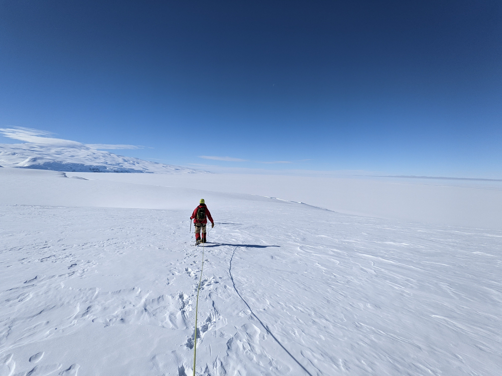
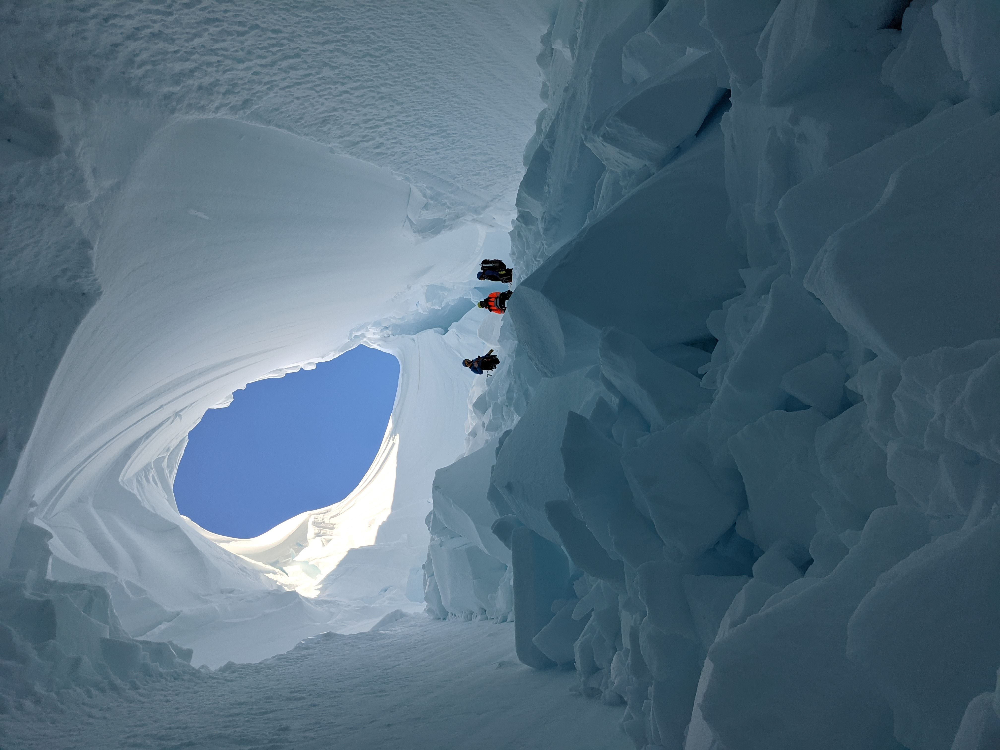
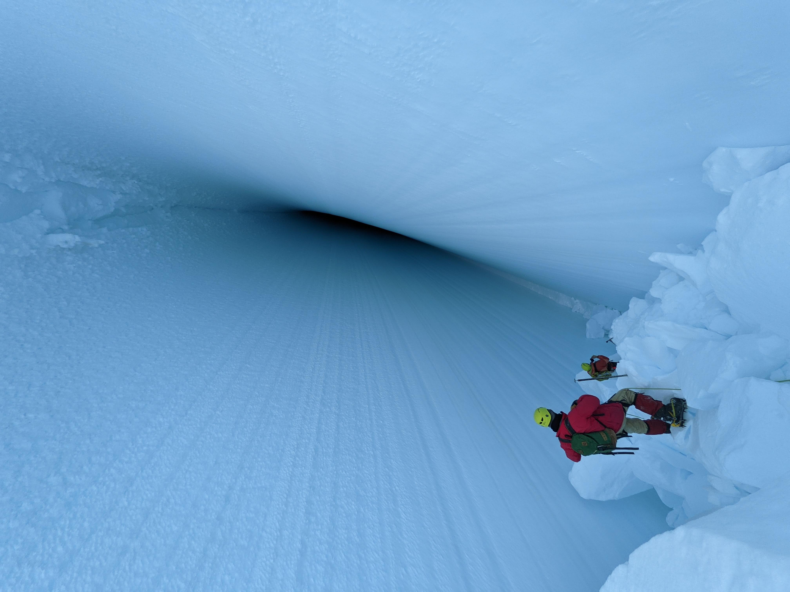
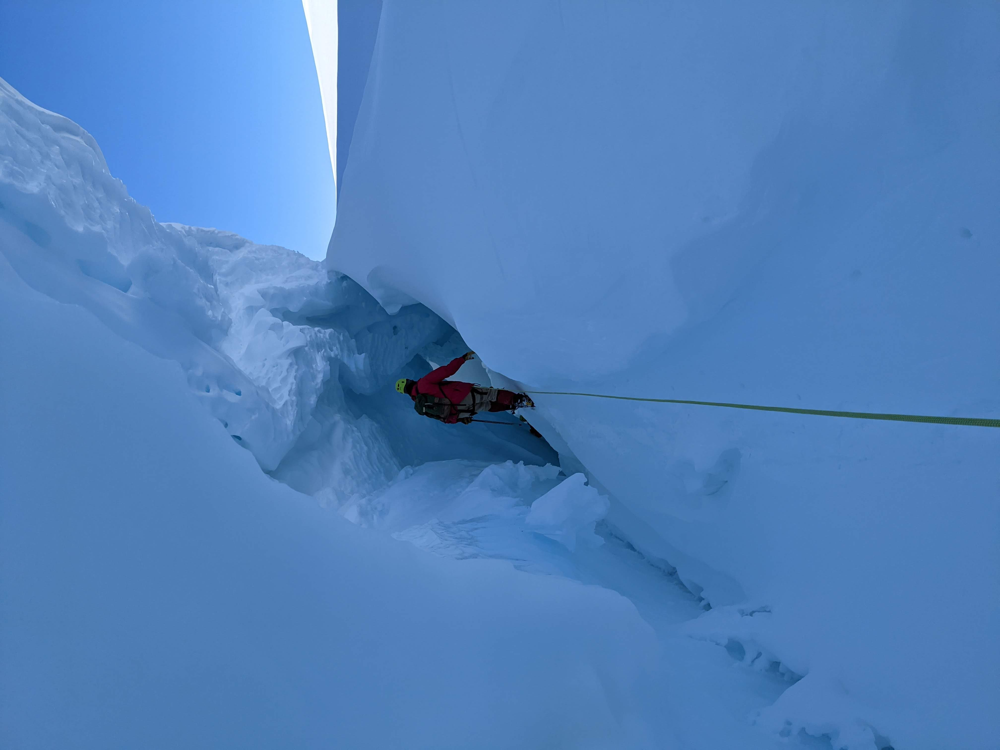
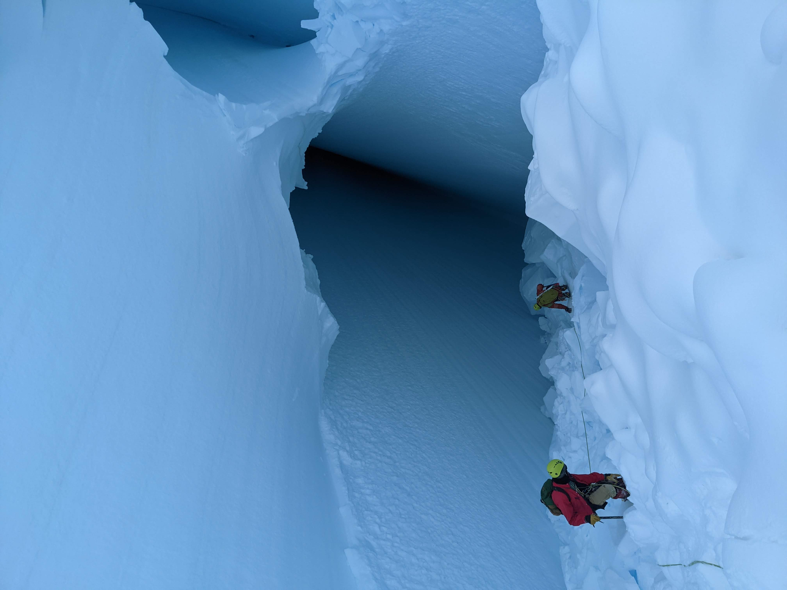

## Southern Spelunking 

Danny May, Paul Summers

Location: McMurdo Base, Antarctica

Nov 9, 2021
	
In the (northern) winter of 21-22, Danny May and Myself (Paul Summers) were lucky enough to travel to McMurdo, Antarctica for field work. As a part of our mandatory crevasse training, our guides Kira Solomon and Mike Roberts found a particularly exciting location. After a easy sno-mobile ride from base, we enjoyed the beautiful view of Erebus and the Erebus glacier and ice tongue, before roping up and heading down the slope overlooking the Ross Ice Shelf. 
After cresting a small roll over, taking care to avoid smaller snow bridges, we made our way towards a small door sized crevasse entrance. Moving down further, we went through a small tunnel before coming to an open topped viewing chamber of a long, extensional crevasse in the glacier. After years of studying glaciers from books, walking through crevasses of one was a truly spectacular experience we won’t soon forget.

  

	
	
	
	
	
	
	
	
	
  

